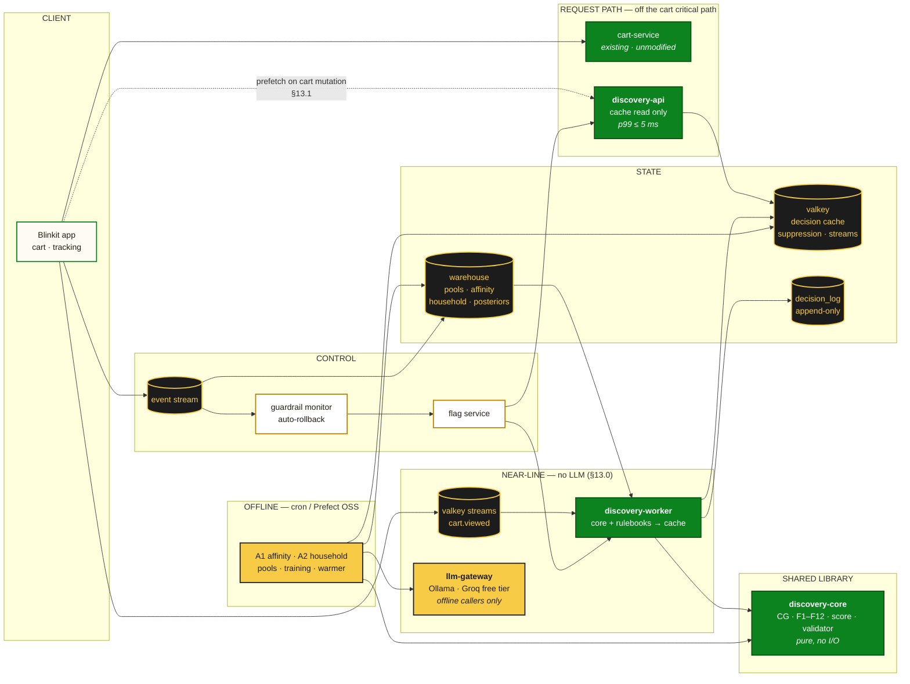
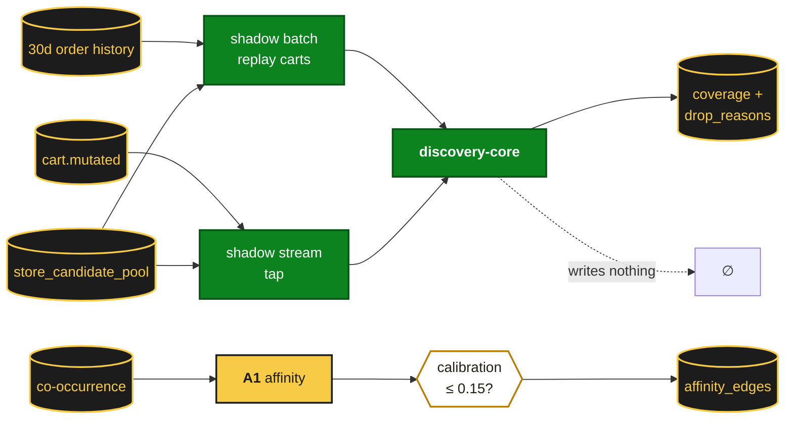
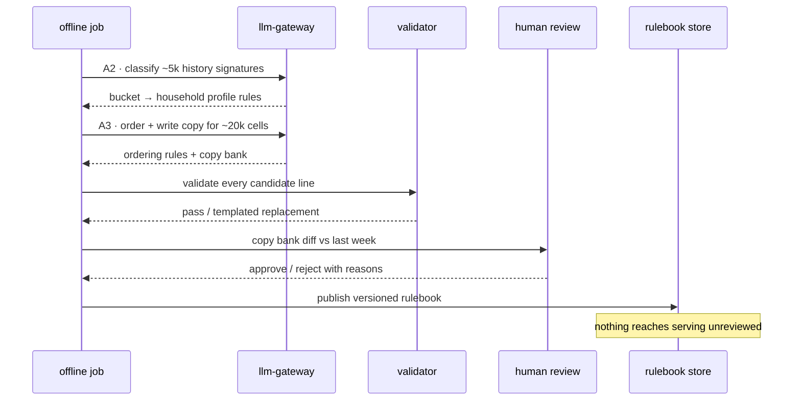
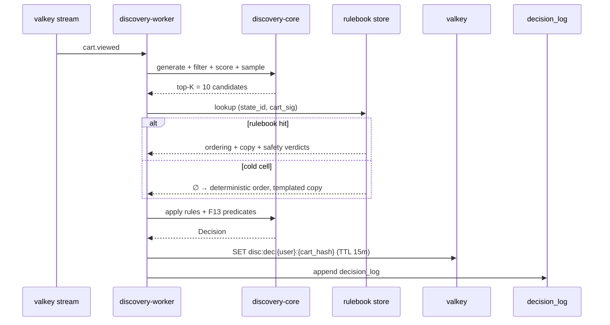
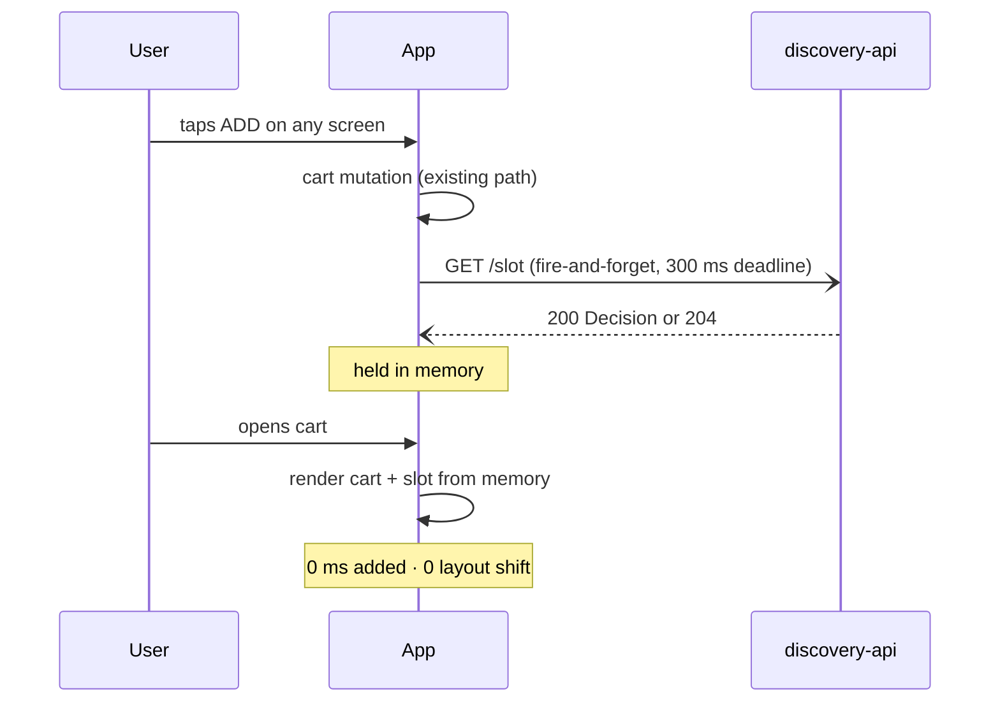

# The Cart Interrupt — Phase-Wise Architecture

**Engineering companion to [solution.md](solution.md)** · Blinkit Cross-Category Expansion
**Status:** Draft for eng review · **Date:** 2 Aug 2026

---

## 0. Purpose and Scope

`solution.md` defines *what* the Cart Interrupt does and *why* — the rankers, filters, experiment design and decision criteria. This document defines *how it gets built*, phase by phase, and what exists in production at the end of each phase.

**Reading order:** §1 (principles) and §2 (target state) are the fixed points. §3 is cross-cutting foundation built once. §4–§10 are the phases. Everything in §4–§10 is additive — no phase rewrites a prior phase's component.

> **Platform notice.** Blinkit's internal platform stack is not public. Rather than guess at it, **§13 resolves every platform dependency onto a zero-cost, fully open-source stack** — Valkey, DuckDB, FastAPI, Ollama, Groq free tier, GitHub Actions — with no feature dropped (preservation matrix in §13.9). Sections §2–§12 name components generically; **§13 is the binding stack decision and supersedes any infrastructure named earlier.** Where an internal equivalent already exists, use it and delete ours — the contracts in §3.2 and §11 are what must hold regardless of substrate.

---

## 1. Architectural Principles

These are the six constraints every design decision below answers to. They are ordered — when two conflict, the lower number wins.

| # | Principle | Consequence |
|---|---|---|
| **1** | **The cart must never get slower.** | The decision is **prefetched by the client on cart mutation** and held in memory (§13.1), so it is never fetched during cart render. `cart-service` is not modified and cannot acquire a new dependency. |
| **2** | **Fail open, except safety.** | Every component degrades to "render nothing." F13/A4 alone fails closed (§7.4). |
| **3** | **One implementation of the decision logic.** | Candidate generation, filters, scoring and validation live in a **pure library** (`discovery-core`) called identically by the shadow runner, the near-line worker and the offline cache warmer. Shadow/live drift is the most likely way this project produces a wrong answer, and a shared library is the only reliable prevention. |
| **4** | **No LLM anywhere in the serving path.** | Strengthened by §13.0: all AI runs offline and emits rulebooks. Neither `discovery-api` nor `discovery-worker` has network egress to the gateway — a dependency that does not exist in those services, not a config flag. |
| **5** | **Every decision is reconstructable.** | `decision_log` is append-only and captures inputs, scores, model ID, LLM output and validator verdict for every served impression. |
| **6** | **Kill switches at every level.** | Global, per-slot, per-component (A3), per-category, per-city. All flag-driven, all effective within one cache TTL (15 min) without a deploy. |

---

## 2. Target-State Architecture (end of Phase 5)



### 2.1 Service inventory

| Service | Type | Owns | Introduced |
|---|---|---|---|
| **`discovery-core`** | Library (Python) | Candidate generation, F1–F12, scoring, output validator. **Zero I/O.** | Phase 0 |
| **`discovery-shadow`** | Batch + stream consumer | Runs core against real carts, emits metrics only. Never writes cache. | Phase 0 |
| **`discovery-worker`** | Valkey Streams consumer | Apply rulebooks via core, write cache and decision log. **No LLM egress.** | Phase 1 |
| **`discovery-api`** | FastAPI service | Cache read, slot policy, response shaping. **No LLM egress.** | Phase 1 |
| **`llm-gateway`** | FastAPI service (~200 LOC) | Ollama + Groq routing, prompt versioning, response cache, rate limit, token accounting. **Called only by offline jobs** (§13.2) | Phase 0 |
| **`discovery-offline`** | cron / Prefect OSS | A1, A2, pools, rulebook generation, model training, posteriors, cache warming | Phase 0 |
| **`guardrail-monitor`** | Scheduled job | Evaluates §8.4 triggers, flips flags | Phase 1 |

---

## 3. Cross-Cutting Foundations

### 3.1 Module layout — the core-as-library decision

```
discovery/
├── core/                        # PURE. No network, no clock, no randomness except injected.
│   ├── candidates.py            # CG1–CG6
│   ├── filters.py               # F1–F14, each a named predicate
│   ├── scoring.py               # v0 rules, v1 learned
│   ├── exploration.py           # Thompson sampling (RNG injected)
│   ├── validator.py             # LLM output validation, deny-list
│   └── types.py                 # CartContext (subtotal post-discount), Candidate, Decision, DropReason
├── shadow/                      # Phase 0 — batch replay + stream tap
├── worker/                      # Phase 1 — near-line orchestration
├── api/                         # Phase 1 — read path
├── offline/                     # scheduled jobs + rulebook generation
└── gateway/                     # LLM gateway client
```

**Why `core` is pure.** It takes a `CartContext` and a candidate pool as arguments and returns a `Decision` plus a `DropReason` histogram. All I/O — inventory lookup, cache, LLM — happens in the callers. Three consequences that matter:

1. **Phase 0's shadow runner and Phase 1's live worker execute byte-identical logic.** The coverage number measured in shadow is the coverage number you get in production. This is the single most important structural decision in the document.
2. Filters are unit-testable without infrastructure. F7 in particular gets an exhaustive test over the full L1 taxonomy.
3. A CI parity test replays a fixed corpus of carts through both callers and asserts identical decisions. This test failing is a release blocker.

### 3.2 Data model

DuckDB + Parquet (§13.0.1). Grain and keys are the contract; storage engine is not.

```sql
-- Rebuilt daily. Drives F1.
user_category_history (
  user_id            BIGINT,
  l1_id              INT,
  purchase_count_365d INT,
  last_purchase_at   TIMESTAMP,
  PRIMARY KEY (user_id, l1_id)
);

-- Taxonomy migrations (EC-P4-03). Tracks L1 splits/merges to remap history & posteriors.
taxonomy_migrations (
  migration_id       UUID PRIMARY KEY,
  old_l1_id          INT,
  new_l1_id          INT,
  migration_type     VARCHAR(16),   -- SPLIT | MERGE | RENAME
  effective_at       TIMESTAMP
);

-- Rebuilt daily. CG1 + CG5 base pool.
store_candidate_pool (
  store_id           INT,
  sku_id             BIGINT,
  l1_id              INT,
  l2_id              INT,
  price_paise        INT,
  margin_pct         DECIMAL(5,2),   -- F10
  velocity_30d       INT,            -- F11
  complaint_rate     DECIMAL(5,4),   -- F11
  smallest_pack_rank INT,            -- CG5 ordering within l1
  volume_ml          INT,            -- F9
  weight_g           INT,            -- F9
  is_excluded_l1     BOOLEAN,        -- F7, denormalised for safety
  updated_at         TIMESTAMP,
  PRIMARY KEY (store_id, sku_id)
);

-- CG2. Weekly. observed_lift NULL = the zero cell A1 fills.
affinity_edges (
  src_l1             INT,
  dst_l1             INT,
  observed_lift      DECIMAL(6,3),
  llm_prior          DECIMAL(4,3),
  reason_code        VARCHAR(24),    -- LIFE_STAGE | COMPLEMENT | OCCASION | ...
  source             VARCHAR(12),    -- OBSERVED | LLM | BLENDED
  effective_score    DECIMAL(6,3),   -- calibration-scaled, what the ranker reads
  approved_by        VARCHAR(64),    -- merchandiser gate
  approved_at        TIMESTAMP,
  model_id           VARCHAR(64),
  PRIMARY KEY (src_l1, dst_l1)
);

-- A2. Daily incremental over active users.
household_state (
  user_id            BIGINT PRIMARY KEY,
  profile            JSONB,          -- closed-enum schema, §5.6.2
  state_id           VARCHAR(32),    -- hash of profile, used as cache key component
  confidence         DECIMAL(3,2),
  model_id           VARCHAR(64),
  computed_at        TIMESTAMP
);

-- F5 / F6. Written by the event pipeline, read by core.
suppression (
  user_id            BIGINT,
  l1_id              INT,
  impressions_total  INT,
  impressions_7d     INT,
  last_shown_at      TIMESTAMP,
  cooldown_until     TIMESTAMP,
  PRIMARY KEY (user_id, l1_id)
);

-- Exploration. Nightly.
bandit_posterior (
  segment            VARCHAR(32),
  l1_id              INT,
  alpha              DECIMAL(10,2),
  beta               DECIMAL(10,2),
  impressions        BIGINT,
  updated_at         TIMESTAMP,
  PRIMARY KEY (segment, l1_id)
);

-- Principle 5. Append-only, never updated, 90-day retention.
decision_log (
  decision_id        UUID PRIMARY KEY,
  user_id            BIGINT,
  cart_hash          VARCHAR(32),
  store_id           INT,
  experiment_arm     CHAR(1),
  candidates_in      JSONB,          -- ids + scores pre-LLM
  llm_output         JSONB,          -- raw, pre-validation
  validator_verdict  VARCHAR(24),
  served_sku_id      BIGINT,
  reason_code        VARCHAR(24),
  copy_source        VARCHAR(8),     -- llm | template
  model_id           VARCHAR(64),
  prompt_version     VARCHAR(16),
  created_at         TIMESTAMP
);
```

### 3.3 Cache design

Valkey (§13.0.1).

| Key | Value | TTL | Written by |
|---|---|---|---|
| `disc:dec:{user_id}:{cart_hash}` | Serialized `Decision` (≤2 KB) | 15 min | worker, warmer |
| `disc:hh:{user_id}` | A2 profile + `state_id` | 24 h | offline DAG |
| `disc:sup:{user_id}` | Suppression counters, all L1 | 7 d | event pipeline |
| `disc:llm:{state_id}:{cart_sig}:{cand_hash}` | A3 output | 7 d | gateway |
| `disc:safe:{cart_sig}:{l2_id}` | A4 verdict | 30 d | gateway |

**`cart_hash` vs `cart_sig` — the distinction that makes this affordable.**

- `cart_hash` = exact cart contents. Used for the *decision* cache, because the served SKU must reflect the actual cart.
- `cart_sig` = sorted L1 set + subtotal bucket (₹150 bands). Used for the *LLM* cache. Two carts differing only in milk brand share an LLM result.

The LLM cache therefore has a key space several orders of magnitude smaller than the decision cache. This is what produces the ≥90% hit-rate assumption in `solution.md` §5.6.6 — and it is the assumption Phase 0 must validate, because if `cart_sig` cardinality is much higher than modelled, A3's cost model collapses.

### 3.4 Latency budget — request path

Resolved by §13.1: the decision is **prefetched by the client on cart mutation**, not fetched at cart render. `cart-service` is not modified and `discovery-api` is not on the cart's critical path.

| Step | Budget | Notes |
|---|---|---|
| Client prefetch, issued on cart mutation | 300 ms client deadline | Fire-and-forget; user is not waiting on it |
| `discovery-api` handler | p99 ≤ 5 ms | Valkey GET + slot policy |
| Valkey GET | p99 ≤ 2 ms | Same host |
| Slot policy + response shaping | p99 ≤ 1 ms | Pure computation |
| **Added to cart render p95** | **0 ms — structurally** | Decision is already in client memory, or absent |

**A timeout is not an error.** `discovery-api` returns `204 No Content` on miss, timeout or disabled flag. The client renders the cart identically in all cases, and a late response is simply discarded rather than inserted — so there is no layout shift, no retry, no circuit-breaker state to reason about.

### 3.5 Capacity model

Derived from Q1 FY27 actuals (331M orders / 90 days):

| Quantity | Value | Derivation |
|---|---|---|
| Orders/day | ~3.7 M | 331M ÷ 90 |
| Peak orders/sec | ~150 | assuming 15% of daily volume in peak hour |
| **Decision computations/day** | **~3.7 M** | One per cart view, deduplicated by cache key (§13.3) |
| Peak decision computations/sec | ~150 | Single Valkey GET each |
| **Live LLM calls** | **0** | Rulebooks precomputed offline (§13.0) |
| Offline LLM calls/week | ~27 k | A1 ~3k · A2 ~5k · A3 ~20k cells · A4 ~40 rules |
| Decision cache working set | ~270 MB | 150/s × 900 s TTL × 2 KB |
| `household_state` rows | ~32 M | ≈ MTC. Populated by **rulebook application**, not 32M LLM calls |
| Event volume | ~37 M/day | ~10 events per order |

**The mutation-rate assumption is gone.** With client prefetch (§13.1) the trigger is one prefetch per cart view, deduplicated by cache key — so the 500 ms debounce and the ~6-mutations-per-order estimate are both deleted. Worker sizing now depends only on cart views, a number we emit ourselves.

### 3.6 Configuration and flags

All runtime behaviour is flag-driven and effective within one TTL without deploy.

| Flag | Type | Default | Introduced |
|---|---|---|---|
| `discovery.enabled` | bool | false | P1 |
| `discovery.slot_a.enabled` | bool | false | P1 |
| `discovery.slot_b.enabled` | bool | false | P3 |
| `discovery.cities` | list | `[]` | P1 |
| `discovery.traffic_pct` | float | 0.0 | P1 |
| `discovery.arm_split` | map | `{A:34,B:33,C:33}` | P2 |
| `discovery.a3.enabled` | bool | false | P2 |
| `discovery.a4.enabled` | bool | true | P2 |
| `discovery.ranker_version` | enum | `v0` | P4 |
| `discovery.exploration_pct` | float | 0.20 | P4 |
| `discovery.f3_price_ceiling_paise` | int | 14900 | P1 |
| `discovery.blocked_l1` | list | F7 list | P1 |
| `discovery.paused_l1` | list | `[]` | P1 |
| `discovery.sponsored.enabled` | bool | false | P6 |

`discovery.blocked_l1` is flag-**readable** but the F7 exclusion is also hard-coded in `core/filters.py`. The flag can only add exclusions, never remove them. A misconfigured flag must not be able to un-block Sexual Wellness.

### 3.7 Observability

| Signal | Where | Alert |
|---|---|---|
| `drop_reasons` histogram by filter ID | Dashboard, per phase | Any filter dropping >90% → investigate |
| Coverage: % carts with ≥1 eligible candidate | Dashboard | < 40% → escalate to Solution 1 |
| Cache hit rate (decision, LLM, safety) | Dashboard | LLM hit < 80% → A3 cost review |
| `discovery-api` p99, timeout rate | SLO | p99 > 5 ms |
| `llm_reject` rate by stage and reason | Dashboard | > 2% warn, > 5% auto-disable A3 |
| `reorder_distance` (Kendall tau, A3 vs deterministic) | Dashboard | → 0 means A3 is a no-op |
| Token spend per 1k impressions | Cost dashboard | Above incremental CM → auto-disable |
| F13 block rate | Dashboard | > 15% or < 0.1% |

### 3.8 Privacy and security

- **A2 profiles never leave the backend.** Not in API responses, not in client events, not in logs beyond `state_id`.
- **Sensitive attributes are absent from the schema**, not filtered downstream. Pregnancy, health conditions and religion cannot be represented in `household_state.profile`, so no bug can leak them.
- **LLM prompts carry no PII.** A3 receives category/L2 labels, a `state_id`-derived enum profile and price bands — never `user_id`, name, address or phone. Verified by a CI test that asserts the prompt payload schema contains no identifier fields.
- **`decision_log` retention 90 days**, then aggregate-only.
- **Prompt injection surface:** candidate `name` fields come from the catalogue, which is internally controlled but brand-supplied. Treat SKU names as untrusted input to A3 — the ID-whitelist enforcement (§7.3) means a malicious product name cannot cause a different SKU to be served, but names must be length-capped and stripped of control characters before entering the prompt.

---

## 4. Phase 0 — Instrument and Shadow (Weeks 1–2)

**No user-facing code. No UI. Nothing rendered.**

### Goal

Answer three questions before any pixel is designed:
1. Is there anything eligible to show? (coverage)
2. Can A1 reproduce known affinities? (calibration)
3. Is `cart_sig` cardinality low enough for A3 to be affordable? (cache hit rate)

### Components built

| Component | Detail |
|---|---|
| `discovery-core` | CG1, CG5, F1–F12, scoring v0, `DropReason` emission. **The whole library, minus the learned ranker.** |
| `discovery-shadow` (batch) | Replays 30 days of historical carts through core. Produces the Appendix C coverage table. |
| `discovery-shadow` (stream) | Taps `cart.mutated`, runs core, emits metrics. **Writes nothing.** |
| `offline/a1_affinity_dag` | Generates `affinity_edges`, computes calibration error |
| `offline/pools_dag` | Builds `store_candidate_pool`, `user_category_history` |
| `llm-gateway` | Offline use only — A1 batch |
| Event schema | All events from `solution.md` §7 defined and deployed, even those nothing emits yet |

### Data flow



### Tests and CI gates

- Unit tests for each of F1–F12 in isolation
- **F7 exhaustive test:** for every L1 in the taxonomy, assert blocked categories can never be emitted, under any input
- Golden-corpus test: 1,000 fixed carts → fixed decisions, checked into the repo
- A1 calibration reported as a build artifact, not just a log line

### Exit gate

| Check | Threshold |
|---|---|
| Coverage (% carts with ≥1 eligible candidate) | ≥ 60% |
| A1 calibration error | ≤ 0.15 |
| LLM cache hit rate projection from `cart_sig` cardinality | ≥ 80% |
| Drop-reason histogram | Reviewed and explicable |

**If coverage < 40%, stop.** The correct output of Phase 0 is then a merchandising escalation to fund Solution 1, not a loosened F3. Write this into the phase exit review so the pressure to proceed meets a pre-committed decision.

### Rollback

Nothing to roll back. Shadow writes no state and serves no users.

---

## 5. Phase 1 — Slot A, Deterministic (Weeks 3–5) · Arm B

**First user-facing code. No AI in the serving path.**

### Goal

Prove the surface renders, converts, and does not harm checkout — establishing the baseline that the AI layer must later beat.

### Components built

| Component | Detail |
|---|---|
| `discovery-worker` | Valkey Streams consumer on `cart.viewed`; calls core; writes decision cache + `decision_log` |
| `discovery-api` | `GET /v1/discovery/slot` → cache read, slot policy, 204 on miss |
| Client prefetch | Fire-and-forget call on cart mutation, held in memory (§13.1). **No `cart-service` change.** |
| Slot A UI | Card per `solution.md` §6.1, templated copy |
| `suppression` pipeline | Event consumer maintaining F5/F6 counters |
| `guardrail-monitor` | Evaluates §8.4 triggers every 5 min, flips flags |
| Experiment assignment | Arm A/B, user-level, 2 cities, 2% |

### API contract

```http
GET /v1/discovery/slot?user_id={}&cart_id={}&slot=A
→ 200 {
    "decision_id": "uuid",
    "sku_id": 88213,
    "l1_label": "Baby Care",
    "reason_code": "COMPLEMENT",
    "reason_line": "Pairs with your usual basket",
    "copy_source": "template"
  }
→ 204   # miss, timeout, ineligible, or flag off — all identical to the caller
```

### The prefetch decision

Rather than adding a call to `cart-service`'s request pipeline — an unknown-cost integration into someone else's critical path — the client issues a fire-and-forget prefetch when it mutates the cart and holds the result in memory (§13.1).

**Trade-off accepted:** a user who taps ADD and opens the cart within ~300 ms sees no suggestion on that render. That is the correct trade — a missing suggestion is invisible, and it buys a **structural** zero-latency guarantee plus zero layout shift, rather than a budgeted one.

### Tests and CI gates

- **Shadow/live parity:** golden corpus replayed through both `discovery-shadow` and `discovery-worker`, decisions must be identical. Release blocker.
- **Latency regression:** cart render p95 with discovery enabled vs disabled, must be within noise
- **Layout-shift test:** assert a late prefetch response is discarded, never inserted
- **Chaos:** kill Valkey → assert 204 and normal cart render
- **Chaos:** kill `discovery-api` → assert normal cart render
- Guardrail-monitor dry-run against synthetic breach data

### Exit gate

Guardrails hold for 3 weeks · add-rate ≥ 3% · zero P1 incidents · no checkout CVR movement outside noise.

### Rollback

`discovery.enabled = false`. Effective within one TTL. No deploy, no data migration. The cart is unchanged because the call was always optional.

---

## 6. Phase 2 — The AI Layer (Weeks 5–8) · Arm C

### Goal

Add A2, A3, A4 and the validator behind arm C, and measure whether the intelligence beats the slot alone.

### Components built

Per §13.0, all four AI components are **offline rulebook generators**. The serving path applies rulebooks deterministically and makes no LLM calls.

| Component | Detail |
|---|---|
| `offline/a2_rulebook_job` | LLM classifies ~5k history-signature buckets → rulebook; code maps all 32M users → `household_state` |
| `offline/a3_rulebook_job` | LLM generates ordering rules + copy bank over ~20k `(state_id, cart_sig)` cells |
| `offline/a4_rules_job` | LLM drafts ~40 block rules → human review → compiled to predicates |
| `core/validator.py` | Runs at **publication** time over the copy bank — 100% reviewed before anything can be served |
| `offline/cache_warmer_job` | Materializes rulebook decisions into the decision cache nightly |
| Worker rulebook application | Deterministic lookup + apply. No gateway dependency. |
| Arm C assignment | 34/33/33 via deterministic hashing (§13.5) |

### Worker sequence

**Offline — weekly rulebook generation:**



**Serving — per cart view, fully deterministic:**



### Failure handling

No live model calls means most runtime LLM failure modes no longer exist. What remains:

| Failure | Behaviour |
|---|---|
| Cold cell — no rulebook entry | Deterministic order, templated copy. Logged as `rulebook_miss`; a rising rate means cell coverage needs widening |
| Rulebook entry references a now-delisted SKU | Filtered by F2/F11 at serving. Rulebooks name **categories and orderings**, not specific SKUs, so this is contained by design |
| Stale rulebook (> 7 days) | Freshness alert; last-known-good stays live. Staleness degrades relevance, never safety |
| Rulebook fails validation at publish | **Not published.** Previous version stays live. This is the whole point of moving validation to publish time |
| F13 predicate evaluation error | **Candidate dropped** (fails closed) |
| `llm-gateway` down | Offline jobs fail, alerting fires, **serving is unaffected** — there is no serving dependency on it |

### Tests and CI gates

- **Validator fuzz suite:** adversarial LLM outputs — unknown IDs, injected IDs, 500-char reason lines, prompt-injection strings, malformed JSON, null fields. Every case must be rejected at publish time, never an exception and never a published bad value.
- **Prompt-payload PII test:** assert no identifier field can reach the gateway
- **Chaos:** delete the rulebook store → assert arm C output is byte-identical to arm B
- **Rulebook parity:** the same rulebook applied by `discovery-shadow` and `discovery-worker` must produce identical decisions — Principle 3 now extends to the AI layer
- **F13 regression corpus:** the worked examples from `solution.md` §5.6.4, plus additions from weekly review, as a fixed test set

### Exit gate

Arm C > arm B on FPNC-30 by ≥ +0.4pp at 95% · rulebook coverage ≥ 70% of cart views · zero unreviewed copy in production.

**If arm C does not beat arm B, delete A3 and ship arm B.** A1 and A2 survive — they feed candidate generation in both arms. This is a pre-committed decision, and the architecture supports it as a flag flip (`discovery.a3.enabled = false`) rather than a rewrite.

### Rollback

`discovery.a3.enabled = false` → arm C collapses to arm B. `discovery.a4.enabled` stays true; the safety gate is not a performance feature. Rulebooks are versioned, so rolling back to last week's is a pointer change.

---

## 7. Phase 3 — Slot B, Order Tracking (Weeks 7–9)

### Goal

Add the tracking-screen module — zero checkout risk, higher exploration.

### Components built

| Component | Detail |
|---|---|
| `discovery-api` slot B path | Up to 3 items, category tiles permitted, F3 ceiling relaxed to ₹299 |
| Tracking screen UI | Below map and timeline |
| Follow-on order path | **Decided** (§13.6) — no fulfilment dependency |
| Exploration at 40% | Slot B only |

### The fork, now closed

`solution.md` §6.2 left this open. §13.6 resolves it: **adds create a follow-on order, not an append to the undispatched one.**

- **Append** would be better UX but needs fulfilment to accept line-item mutation after order creation and before picking — a race with the picker, an idempotent append API, and a compensating path if picking has started. Non-zero cost, external dependency, unknown timeline.
- **Follow-on order** needs nothing from anyone.

Instrument the funnel `slot_b_add → follow_on_order_completed`. That drop-off is the entire business case for the append path, and it should be measured before anyone builds it.

### Exit gate

Guardrails hold · Slot B add-rate measured · no order-cancellation movement.

---

## 8. Phase 4 — Learned Ranker (Weeks 9–13)

### Goal

Replace scoring v0 with the learned `p_add × [w₁·CM + w₂·V_cat·p_repeat]` ranker and activate Thompson sampling.

### Components built

| Component | Detail |
|---|---|
| `offline/training_dag` | LightGBM `p_add` and `p_repeat`, weekly retrain, feature set per `solution.md` Appendix B |
| Feature parity | Single-definition dual-sink over DuckDB (§13.4) — no feature store |
| Model registry | Versioned artifacts, `ranker_version` flag selects |
| `core/scoring.py` v1 | Loads model in-process in the worker (not a separate service — the worker is already async) |
| `offline/posteriors_dag` | Nightly Beta updates for 112 arms |

### Training data provenance

Labels come from `decision_log` joined to `interrupt_add`. **This creates a feedback loop: the model is trained on impressions the previous model chose.** Two mitigations, both required:

1. **The exploration arm is the unbiased sample.** Train `p_add` with inverse-propensity weighting using the recorded exploration probability, which `decision_log` captures per decision.
2. **The 5% never-treated holdout** provides a clean counterfactual for `p_repeat` — repeat behaviour in the absence of any nudge.

Without these the ranker converges on whatever v0 happened to favour and calls it truth. This is the standard recommender failure mode and it is worth the extra column in `decision_log` to avoid.

### Exit gate

FPNC-30 lift ≥ +1.0pp · offline/online feature parity verified · no guardrail movement on ranker switch.

### Rollback

`discovery.ranker_version = v0`. The v0 rules path is never deleted.

---

## 9. Phase 5 — Scale (Weeks 14–17)

### Goal

2% → 25% → 100%, all cities.

### Work

| Area | Detail |
|---|---|
| Capacity | Worker horizontal scaling; Valkey sizing to §3.5 targets ×1.5 headroom |
| Cache warming | Extend warmer coverage as `cart_sig` distribution broadens across cities |
| Regional pools | `store_candidate_pool` partitioned by store; verify tier-2/3 assortment depth — **expect coverage to differ materially from the 2 metro launch cities** |
| Cost | LLM spend scales ~linearly with cache misses; new cities mean new `cart_sig` values and a temporary hit-rate dip |
| Guardrails | Per-city breakdown; auto-rollback scoped per city, not globally |

**Scale-up ramp:** 2% → 10% → 25% → 50% → 100%, minimum 4 days at each step, with a full guardrail read before each increase. The novelty-decay logic from `solution.md` §8.2 applies at every step — a fresh cohort produces a fresh week-1 bump.

### Exit gate

60-day category repeat rate ≥ 25% · guardrails hold at 100% · cost per incremental add within target.

---

## 10. Phase 6 — Monetization (Weeks 18+)

Deliberately last. Only after a clean organic incrementality read.

| Component | Detail |
|---|---|
| CG6 activation | Ad-eligible pool joins candidate generation |
| Bid term | `w₃·Bid(c)` added to `S(c)` |
| Sponsored quality floor | Paid candidate must pass all of F1–F13 **and** reach ≥80% of top organic `p_add` |
| Billing integration | Cost-per-verified-trial, not CPC |
| Disclosure | "Sponsored" label — non-negotiable, and a legal review item |

**Architectural guard:** the quality floor is implemented in `core/filters.py` as a filter, not in the scoring function. A bid can lose to a floor; it must never be able to buy past one. Keeping it in the filter layer means it is covered by the same exhaustive test discipline as F7.

---

## 11. Failure Modes

| Failure | Blast radius | Detection | Behaviour |
|---|---|---|---|
| Valkey unavailable | Discovery only | API timeout rate | 204, cart normal |
| `discovery-api` down | Discovery only | Health check | Client prefetch fails silently, cart normal |
| Worker lag > 5 min | Stale suggestions | Consumer lag | Decisions expire at TTL → 204 |
| LLM gateway down | **Offline jobs only** | Gateway 5xx rate | Serving unaffected; rulebooks go stale, alert fires |
| Rulebook cold cell | None | `rulebook_miss` rate | Deterministic order, templated copy |
| Rulebook fails publish validation | None | Publish job status | Previous version stays live |
| F13 predicate error | Fewer suggestions | Error rate | **Candidate dropped** (fails closed) |
| Stale `store_candidate_pool` | Possible OOS suggestion | DAG freshness alert | F2 real-time check catches at filter; ADD-time revalidation catches the rest |
| Poisoned affinity edge | Bad category suggestions | Merchandiser review, add-rate drop | `discovery.paused_l1` flag; edge rollback via `approved_at` |
| Flag service down | Frozen config | Health check | Last-known-good flags cached locally, fail to **disabled** |
| Checkout CVR regression | Revenue | Guardrail monitor, 5 min | Auto-rollback |

**Every row degrades discovery, not the cart.** If a future change makes any row able to break checkout, that change violates Principle 1.

---

## 12. Environments and CI/CD

| Environment | Purpose |
|---|---|
| `dev` | Core library, unit tests, Ollama local, no API keys needed |
| `staging` | Full stack on one free-tier VM, synthetic cart traffic, chaos suite |
| `shadow` (prod) | Real traffic, no writes, no serving — permanent, not just Phase 0 |
| `prod` | Flag-gated rollout |

Everything except `prod` runs on a single machine. `dev` needs no credentials at all — Ollama serves the model locally, so a new contributor can run the whole pipeline offline.

**Keep the shadow environment permanently.** It is how every subsequent ranker or filter change gets validated against real traffic before it serves anyone, and it costs one consumer.

### Release-blocking CI gates

1. Shadow/live parity on the golden corpus
2. F7 exhaustive exclusion test
3. Validator fuzz suite
4. Prompt-payload PII assertion
5. Cart-render latency regression
6. Chaos suite: Valkey down, rulebook store empty, API down — all must render a normal cart

---

## 13. Resolved Platform Decisions

All seven questions are closed. Two constraints drove every resolution:

1. **Zero cost.** No paid service, no paid tier, no licence fee.
2. **No feature dropped.** Every filter, ranker, AI component, experiment arm and guardrail in `solution.md` survives intact — see the preservation matrix in §13.9.

Four of the seven depended on Blinkit-internal systems I cannot inspect. For those, the resolution is **to remove the dependency rather than guess at it.** A design that works regardless of the answer is strictly better than one that needs the answer.

### 13.0 The unifying move: LLMs generate rulebooks, code applies them

One decision resolves the cost problem across the entire AI layer, and it is a direct extension of the ReviewLens determinism gradient.

> **No AI component runs per-request or per-user. Each one runs offline over a bounded space of *situations* and emits a rulebook. The serving path applies rulebooks deterministically.**

| | Naive (per-request) | Rulebook (adopted) |
|---|---|---|
| **A1** Affinity | per basket | 784 L1 pairs + ~2k basket signatures, weekly → `affinity_edges` |
| **A2** Household | **per user × per day** — 32M calls/day, impossible free | ~5k distinct history-signature buckets → a **classification rulebook**; 32M users mapped by code |
| **A3** Sort + copy | per cart mutation — ~550k/day | ~20k `(state_id × cart_sig)` cells → an **ordering rulebook + copy bank** |
| **A4** Safety | per (cart × candidate) pair | ~40 human-reviewed **block rules** in natural language, compiled to predicates |

Cost falls from ~32M calls/day to roughly **27k calls/week**, which fits inside a free tier with room to spare. But the reason to do it is not only cost:

- **100% of user-visible copy is reviewable before it ships.** The §5.6.5 deny-list stops being a runtime gamble and becomes a pre-publication check on a finite copy bank. Every line a user can possibly see has been read by a human.
- **The serving path becomes fully deterministic**, so shadow/live parity (Principle 3) extends to the AI layer, which it could not under per-request inference.
- **Rulebooks are diffable.** A weekly regeneration produces a reviewable changeset, not a silent distribution shift.

The cost is specificity: a rulebook reasons about a *cell*, not this exact cart. Cell granularity is the tuning knob, and cold cells fall back to deterministic order (arm B behaviour) — which the architecture already supports everywhere.

### 13.0.1 The free stack

| Need | Choice | Licence | Replaces |
|---|---|---|---|
| Runtime | Python 3.11 | PSF | — |
| `discovery-core` | stdlib + Pydantic | MIT | — |
| `discovery-api` | FastAPI + Uvicorn | MIT / BSD | — |
| Message bus | **Valkey Streams** | BSD-3 | Kafka |
| Cache / KV | **Valkey** | BSD-3 | Redis (Redis 8+ is AGPLv3 — also free, copyleft) |
| Warehouse | **DuckDB + Parquet** | MIT | Snowflake / BigQuery |
| Orchestration | **cron**, or Prefect / Dagster OSS | Apache-2.0 | Airflow (also free) |
| ML | LightGBM / scikit-learn | MIT / BSD | — |
| Model serving | in-process | — | dedicated service |
| LLM — bulk | **Ollama**, local `llama3.1:8b` | MIT | paid inference |
| LLM — quality | **Groq free tier**, `llama-3.3-70b` | free tier | paid inference |
| Feature store | DuckDB single-definition dual-sink (§13.4) | MIT | Feast / Tecton |
| Experiments | deterministic hashing (§13.5) | — | Optimizely / internal |
| Flags | JSON in git → Valkey mirror | — | LaunchDarkly |
| Metrics | Prometheus + Grafana OSS | Apache-2.0 / AGPLv3 | Datadog |
| CI | GitHub Actions free tier | — | — |
| Hosting | Oracle Cloud Always Free / self-host | — | — |

Single-node footprint: one small VM runs Valkey, DuckDB, the API, the worker and Ollama. Everything scales horizontally later without a rewrite, because nothing here is a hosted-service API.

---

### 13.1 Q1 — cart-service parallel call → **RESOLVED: client-side prefetch, zero backend change**

**Decision: do not touch `cart-service`.** The client prefetches the decision at the moment it mutates the cart, holds it in memory, and renders it synchronously when the cart screen opens.



**Why this is better than the parallel server call, not merely cheaper:**

| | Server-side parallel call | Client prefetch |
|---|---|---|
| `cart-service` change | Required | **None** |
| Added cart-render latency | 0 ms if truly parallel, non-zero if not | **0 ms, structurally** |
| Layout shift | Possible if response is late | **Impossible** — decision is present or absent before first paint |
| Blast radius on failure | Inside the cart request path | **Outside it entirely** |
| Phase 1 duration | 2–6 weeks, unknown | **2 weeks, known** |

If the prefetch has not returned by the time the cart opens, the slot simply does not exist for that render. Fail-open (Principle 2) is preserved and is now enforced by physics rather than by a timeout config.

**Consequence:** Principle 1 is upgraded from a latency budget to a structural guarantee. `discovery-api` is no longer on the cart's critical path at all.

### 13.2 Q2 — LLM gateway → **RESOLVED: build it, ~200 lines, two free backends**

`llm-gateway` is a small FastAPI service with four responsibilities:

| Responsibility | Implementation |
|---|---|
| Backend routing | `bulk` → Ollama local · `quality` → Groq free tier · both configurable |
| Response cache | Valkey, keyed by `sha256(prompt_version + payload)` |
| Rate limiting | Token bucket per backend, sized to the free tier's published RPM/TPM |
| Accounting | Append token counts and latency to `llm_usage.parquet` |

**Backend split:**
- **Ollama (`llama3.1:8b`) for volume.** Throughput is bounded by hardware you already own, not by a quota. Runs the A3 copy bank and A2 signature classification.
- **Groq free tier (`llama-3.3-70b`) for quality-critical, low-volume work.** A1's 784 affinity pairs weekly, A4's ~40 block rules, and spot-audits of Ollama output. Confirm current free-tier RPM/TPM before sizing the bucket — the design must fit whatever it is, and §13.0 makes that easy because total demand is ~27k calls/week.

**Because of §13.0 there are no live LLM calls in serving.** The gateway is invoked only by offline jobs. Principle 4 strengthens from "no LLM in the request path" to **"no LLM anywhere in the serving path, near-line included."**

### 13.3 Q3 — Cart mutation rate → **RESOLVED: dependency removed**

The worker no longer computes per mutation. With client prefetch (§13.1) the trigger is the prefetch request itself — **at most one decision computation per cart view**, naturally deduplicated by the decision cache.

Worker sizing therefore depends on *cart views*, a number we now generate ourselves and can read off our own events from day one. The ~6 mutations/order assumption in §3.5 is deleted, and the 500 ms debounce becomes redundant — cache-key deduplication does the same job for free.

**Revised capacity at production scale:** ~3.7M cart views/day, ~150/sec peak, one Valkey GET each. A single node handles this. At prototype scale it is trivial.

### 13.4 Q4 — Feature store → **RESOLVED: single-definition dual-sink over DuckDB**

No feature store. Each feature is defined **once**, as a named SQL expression in `offline/features.sql`, and materialized to two sinks by the same job:

```
features.sql  ──┬──▶  features.parquet   (training — DuckDB reads directly)
                └──▶  Valkey hash        (serving — flat KV per user/SKU)
```

Offline/online parity is guaranteed **by construction** rather than by monitoring: there is one expression, and a CI test asserts that a sample of users produces byte-identical feature vectors from both sinks. This is the property a feature store exists to provide, and at this scale it costs a SQL file and a test.

### 13.5 Q5 — Experiment platform → **RESOLVED: deterministic hashing, reserved holdout buckets**

Stateless, no service, reproducible offline:

```python
def bucket(user_id: int, salt: str = "cart_interrupt_v1") -> int:
    return int(sha256(f"{salt}:{user_id}".encode()).hexdigest()[:8], 16) % 100

# 95–99 are permanently reserved. No experiment may claim them.
HOLDOUT = range(95, 100)

def arm(user_id: int) -> str:
    b = bucket(user_id)
    if b in HOLDOUT:      return "HOLDOUT"
    if b < 32:            return "A"   # control
    if b < 63:            return "B"   # deterministic
    return "C"                          # AI layer
```

Properties this gives free: stable assignment across sessions and deploys; reproducible in any analysis notebook from `user_id` alone, so no assignment log is needed; the 5% never-treated holdout enforced in code rather than by convention. Changing `salt` re-randomizes for a fresh experiment.

### 13.6 Q6 — Fulfilment append → **RESOLVED: follow-on order, decided**

**Slot B adds create a new order.** No fulfilment change, no picker race, no compensating transaction, no cost.

Instrument the funnel `slot_b_add → follow_on_order_completed`. That drop-off is the entire business case for the append path, and it should be measured before anyone builds it. Revisit only if the gap is large enough to justify a fulfilment integration.

### 13.7 Q7 — `decision_log` retention → **RESOLVED: 14-day hot, 1% sampled cold, hashed**

| Age | Fidelity | Storage |
|---|---|---|
| 0–14 days | Full rows, `user_id` present | `decision_log_hot.parquet` |
| 14–90 days | **1% stratified sample** (all arms, all `validator_verdict` values, 100% of `llm_reject` and `safety_block` rows), `user_id` → salted hash | `decision_log_cold.parquet` |
| 90+ days | Daily aggregates only, no row-level data | `decision_metrics.parquet` |

`llm_reject` and `safety_block` rows are retained in full at every tier — they are the audit trail that matters, and they are rare.

Principle 5 (every decision reconstructable) holds fully for 14 days and for the sampled set thereafter. Storage falls from ~100 GB to under 5 GB, which fits on free-tier disk. The salted hash also means the cold tier carries no direct identifier — the retention policy improves the privacy posture rather than trading against it.

---

### 13.8 What the free constraint actually costs

Stated plainly, because a design that claims no trade-offs is hiding them:

| Cost | Severity | Detail |
|---|---|---|
| **A3 loses per-cart specificity** | Medium | Rulebooks reason about a cell, not this exact cart. Mitigate with finer cells; measure via arm C vs arm B, which was always the test |
| **Cold cells get no AI ordering** | Low | Falls back to deterministic order — arm B behaviour, already a shipped path |
| **Rulebook staleness up to 7 days** | Low | Weekly regeneration. Occasion rules refresh on the merchandiser calendar instead |
| **Ollama 8B is weaker than a hosted 70B** | Medium | Confined to bulk copy generation, where output is 100% human-reviewed before publication. A1 and A4 — where reasoning quality matters — stay on the 70B via Groq |
| **Single-node infra has no HA** | Low here | Every failure mode degrades discovery, never the cart (§11). Acceptable precisely because the feature is optional by design |
| **No managed observability** | Low | Prometheus + Grafana OSS covers it; alerting is a cron job reading DuckDB |

Nothing on this list touches the guardrails, the filters, the safety gate or the experiment design.

### 13.9 Feature preservation matrix

Every feature specified in `solution.md`, and how it survives on free infrastructure.

| Feature | Spec | Preserved | How |
|---|---|---|---|
| CG1–CG6 candidate generation | §5.1 | ✅ | Pure Python over DuckDB-built pools |
| F1–F12 hard filters | §5.2 | ✅ | `discovery-core`, unchanged |
| F13 semantic safety | §5.2, §5.6.4 | ✅ | LLM-authored block rules, compiled to predicates, fails closed |
| Scoring v0 rules | §5.3 | ✅ | Unchanged |
| Learned ranker `p_add` / `p_repeat` | §5.3 | ✅ | LightGBM in-process, IPW-corrected |
| Thompson sampling, 112 arms | §5.4 | ✅ | Beta posteriors in DuckDB, nightly cron |
| Slot policy A / B | §5.5 | ✅ | Unchanged |
| A1 semantic affinity + calibration gate | §5.6.1 | ✅ | Groq free tier, ~3k calls/week |
| A2 household state | §5.6.2 | ✅ | **Rulebook** over ~5k signature buckets, applied by code |
| A3 final sort + suggestion copy | §5.6.3 | ✅ | **Ordering rulebook + pre-reviewed copy bank** |
| A4 / F13 safety gate | §5.6.4 | ✅ | ~40 reviewed rules, compiled |
| Output validator + deny-list | §5.6.5 | ✅ **Strengthened** | Now a pre-publication gate on a finite copy bank — 100% reviewed, not sampled |
| Slot A cart UI | §6.1 | ✅ | Client prefetch, zero layout shift |
| Slot B tracking UI | §6.2 | ✅ | Follow-on order |
| Trust line honesty rules | §6.3 | ✅ | Unchanged |
| Full event instrumentation | §7 | ✅ | Valkey Streams → Parquet sink |
| 3-arm experiment + 5% holdout | §8.1 | ✅ | Deterministic hashing, reserved buckets |
| Decision criteria incl. repeat gate | §8.3 | ✅ | DuckDB analysis |
| Auto-rollback guardrails | §8.4 | ✅ | Cron monitor → flag file → Valkey |
| Latency budget | §9 | ✅ **Strengthened** | 0 ms added is now structural, not budgeted |
| Immutable decision log | Principle 5 | ✅ | Tiered retention (§13.7) |
| Kill switches at every level | Principle 6 | ✅ | JSON flags in git, hot-reloaded |

**Nothing was dropped.** Three things got stronger: copy review moved from runtime sampling to full pre-publication, the latency guarantee moved from a budget to a structural property, and the serving path became fully deterministic — which extends shadow/live parity to the AI layer.

### 13.10 Remaining true unknowns

Two facts still require a Blinkit-internal answer, but neither blocks a build:

1. **Current Groq free-tier RPM/TPM.** Sizes the token bucket. Check before Phase 0; §13.0 keeps total demand low enough that any plausible limit works.
2. **Whether an internal equivalent already exists** for any component above. If so, use it and delete ours — the contracts in §3.2 and §11 are what must hold.

---

## Appendix A — Phase Summary

| Phase | Weeks | Ships | Key risk retired |
|---|---|---|---|
| **0** | 1–2 | Shadow pipeline, A1, pools | Is there anything to show? |
| **1** | 3–5 | Slot A, deterministic, arm B | Does the surface harm checkout? |
| **2** | 5–8 | A2, A3, A4, validator, arm C | Does the AI beat the slot alone? |
| **3** | 7–9 | Slot B | Does zero-risk placement convert? |
| **4** | 9–13 | Learned ranker, bandit | Can it be optimized without bias? |
| **5** | 14–17 | 100% rollout | Does it hold outside metros? |
| **6** | 18+ | Sponsored pool | Can it monetize without decay? |

## Appendix B — Component × Phase Matrix

| Component | P0 | P1 | P2 | P3 | P4 | P5 | P6 |
|---|:-:|:-:|:-:|:-:|:-:|:-:|:-:|
| `discovery-core` (CG, F1–F12, v0) | ● | ● | ● | ● | ● | ● | ● |
| `discovery-shadow` | ● | ● | ● | ● | ● | ● | ● |
| A1 affinity DAG | ● | ● | ● | ● | ● | ● | ● |
| Pools / history DAGs | ● | ● | ● | ● | ● | ● | ● |
| `discovery-worker` | | ● | ● | ● | ● | ● | ● |
| `discovery-api` | | ● | ● | ● | ● | ● | ● |
| Slot A UI | | ● | ● | ● | ● | ● | ● |
| Suppression pipeline | | ● | ● | ● | ● | ● | ● |
| `guardrail-monitor` | | ● | ● | ● | ● | ● | ● |
| A2 household DAG | | | ● | ● | ● | ● | ● |
| A3 sort + copy | | | ● | ● | ● | ● | ● |
| A4 / F13 safety | | | ● | ● | ● | ● | ● |
| Output validator (live) | | | ● | ● | ● | ● | ● |
| Cache warmer | | | ● | ● | ● | ● | ● |
| Slot B UI | | | | ● | ● | ● | ● |
| Learned ranker + bandit | | | | | ● | ● | ● |
| Feature store | | | | | ● | ● | ● |
| Sponsored pool (CG6) | | | | | | | ● |

---

*Cross-references to `solution.md`: filters §5.2 · scoring §5.3 · AI layer §5.6 · UX §6 · events §7 · experiment §8 · guardrails §8.4.*
