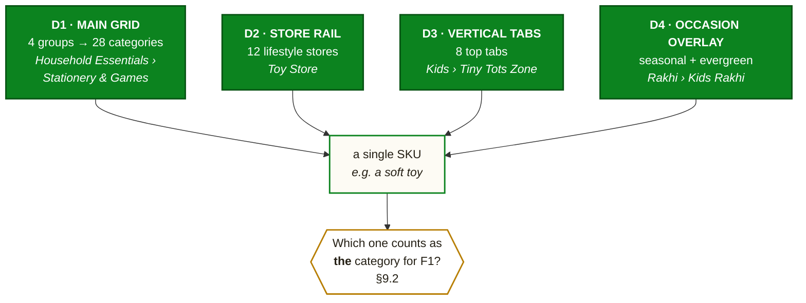

# Blinkit — Observed Category Taxonomy

**Reference companion to [solution.md](solution.md), [architecture.md](architecture.md), [eval.md](eval.md) and [edgecases.md](edgecases.md)**
**Status:** Draft — **contains 6 corrections to prior documents** (§9) · **Date:** 2 Aug 2026

---

## 0. Provenance

| | |
|---|---|
| **Source** | In-app captures, Blinkit Android, Aug 2026 |
| **Coverage** | Home feed · Categories page · Reorder tab · 7 store verticals |
| **Location** | Single metro pincode, one dark store |
| **Confidence** | ✅ read clearly · ⚠️ small or truncated in capture, verify before relying on it |

> **Assortment is store-curated.** Everything below is what one dark store exposed on one day. Category *presence* generalises; category *depth* does not. Any coverage or eligibility number computed from this document must be re-derived per store (`edgecases.md` EC-P5-02, EC-P5-03).

This supersedes the web-nav capture recorded in `solution.md` §2.2, which saw only the main grid and missed two entire navigation tiers.

---

## 1. The Taxonomy Is Four Dimensions, Not One

The prior documents assumed a clean tree: L0 group → L1 category → L2 subcategory. **The app has four coexisting dimensions**, and a single SKU is reachable through several of them.

| Dim | What it is | Count | Persistent? |
|---|---|---|---|
| **D1** Main grid | The canonical merchandising tree | 4 groups → 28 categories → L2 | Yes |
| **D2** Store rail | Curated lifestyle storefronts below the fold | 12 stores | Yes |
| **D3** Vertical tabs | Top-of-screen store switcher | 8 tabs | Mostly |
| **D4** Occasion overlay | Festival and occasion merchandising | Rotating | No — seasonal |

**This matters because F1 (`NEW_CATEGORY_GATE`) is defined on "L1 category" and the app has no single L1.** §9.2 resolves it.

---

## 2. D1 — The Main Grid ✅

Four groups, 28 categories. Identical in the home feed and the Categories page. `l1_id` values assigned here are canonical for the whole document set.

### 2.1 Grocery & Kitchen — `G1`

| id | Category | Notes |
|---|---|---|
| 1 | Vegetables & Fruits | Fresh; anchors the replenishment loop |
| 2 | Atta, Rice & Dal | |
| 3 | Oil, Ghee & Masala | |
| 4 | Dairy, Bread & Eggs | Highest-frequency L1 |
| 5 | Bakery & Biscuits | |
| 6 | Dry Fruits & Cereals | |
| 7 | Chicken, Meat & Fish | |
| 8 | Kitchenware & Appliances | **Non-consumable inside a grocery group** — a natural bridge |

### 2.2 Snacks & Drinks — `G2`

| id | Category | Notes |
|---|---|---|
| 9 | Chips & Namkeen | |
| 10 | Sweets & Chocolates | Gifting overlap |
| 11 | Drinks & Juices | |
| 12 | Tea, Coffee & Milk Drinks | |
| 13 | Instant Food | |
| 14 | Sauces & Spreads | |
| 15 | **Paan Corner** | 🚫 **F7 — tobacco** |
| 16 | Ice Creams & More | Also surfaced as "Ice Cream Store" (D2) |

### 2.3 Beauty & Personal Care — `G3`

| id | Category | Notes |
|---|---|---|
| 17 | Bath & Body | |
| 18 | Hair | |
| 19 | Skin & Face | Deepest L2 tree observed (§5.1) |
| 20 | Beauty & Cosmetics | |
| 21 | Feminine Hygiene | Dignity-sensitive — `edgecases.md` EC-P2 |
| 22 | **Baby Care** | Also a full vertical: Kids tab / Tiny Tots Zone |
| 23 | **Health & Pharma** | 🚫 **F7** — also duplicated as "Pharma Store" (D2) |
| 24 | **Sexual Wellness** | 🚫 **F7** |

### 2.4 Household Essentials — `G4`

| id | Category | Notes |
|---|---|---|
| 25 | Home & Lifestyle | Also the Decor vertical |
| 26 | Cleaners & Repellents | |
| 27 | Electronics | Also the Electronics vertical |
| 28 | Stationery & Games | Overlaps Toy Store, Book Store, Hobby Store |

**Six of the 28 double as a store or a vertical.** That overlap is the source of the F1 ambiguity in §9.2.

---

## 3. D2 — The Store Rail ✅

Two rails, well below the fold on both home and Categories. **This is the tier the web-nav capture missed entirely.**

### 3.1 "Stores in spotlight" — `S01–S04`

| id | Store | Maps to D1 | New category? |
|---|---|---|---|
| S01 | Ice Cream Store | 16 · Ice Creams & More | No |
| S02 | Travel Store | — | **Yes** |
| S03 | Hobby Store | ~28 partial | **Yes** |
| S04 | Sports Store | — | **Yes** |

### 3.2 "Picks for your lifestyle" — `S05–S12`

| id | Store | Maps to D1 | New category? |
|---|---|---|---|
| S05 | Spiritual Needs | — | **Yes** |
| **S06** | **Pet Store** | — | **Yes — see §9.1** |
| S07 | Fashion Basics | — | **Yes** |
| S08 | Toy Store | ~28 partial | Partial |
| S09 | Book Store | ~28 partial | Partial |
| S10 | Pharma Store | 23 · Health & Pharma | No — 🚫 **F7 duplicate route** |
| S11 | E-Gifts Store | — | **Yes** ⚠️ digital goods |
| S12 | Jewellery Store | — | **Yes** |

**Eight of twelve stores have no home in the 28-category grid.** They are only reachable by scrolling past every grocery tile to a rail near the bottom of the page — which is, quite literally, the "buried category entry points" barrier the research identified, now located precisely.

---

## 4. D3 — Vertical Tabs ✅

The horizontal strip under the search bar. Order varies; **Rakhi appears only in season**.

| id | Tab | Type | Own taxonomy? |
|---|---|---|---|
| T1 | All | Default home | — |
| T2 | Rakhi | **Seasonal** (D4) | Yes (§6) |
| T3 | Electronics | Vertical | Yes (§5.2) |
| T4 | Beauty | Vertical | Yes (§5.1) |
| T5 | Decor | Vertical | Yes (§5.4) |
| T6 | Kids | Vertical | Yes (§5.3) |
| T7 | Gifting | Vertical | Yes (§5.5) |
| T8 | Imported | **Attribute, not a category** — see §7 | Yes (§5.6) |

---

## 5. Per-Vertical Subcategories

### 5.1 Beauty (T4) ✅ — the deepest tree observed

**Shop by category (20):** Lip Cosmetics · Face Cosmetics · Eye Makeup · Nail Cosmetics · Serums & Toners · Sunscreens, Cleansers & More · Lip Balms & Masks · Facial Kits & Face Masks · Hair Colour & Touch-up · Hair Masks & Serums · Hair Styling · Shampoo & Oils · Bath & Body Tools · Beauty Accessories · Hair Brushes & Tools · Hair & Nail Extensions · Luxury Beauty · Perfumes & Gift Sets · Women's Grooming · Men's Grooming

**Shop by concern (3):** Acne · Hairfall · Sun Protection

**Ingredient rail:** Vitamin C · Niacinamide · Salicylic Acid & More

**Editorial rails:** Haircare Sundays (Henna & Hair Creams · DIY Hair Spa · Wash Day Essentials) · Korean care for skin and hair · Brands in Spotlight

> **"Shop by concern" is a genuinely different axis** — need-state rather than product type. It is the closest thing in the live app to the contextual discovery this programme is trying to build, and it exists only inside the Beauty vertical. Worth studying before designing the Slot A reason taxonomy.

### 5.2 Electronics (T3) ✅

**Featured:** Earbuds & Headsets · Power Banks & Chargers · Speakers ⚠️

**Power-packed deals (5):** Electronic Accessories · Audio & Accessories · Appliances · Computer Accessories · Chargers & Cables

**Home and kitchen (8):** Irons & More · Fans, Coolers & More · Extension Boards & More · LED & Lamps · Cookware · Juicers, Frothers & More ⚠️ · Cleaning Gadgets · Hand & Power Tools

**Audio and gaming (4):** Earbuds & Headsets · Speakers & Soundbars · Smart Watches · Gaming Essentials

**Grooming and wellness (4):** Trimmers · Hairstyling Tools · Massagers & Weighing Machines ⚠️ · Electric Toothbrush

**Mobile and computer (4):** Mobiles, Chargers & More ⚠️ · Storage Solutions & More ⚠️ · Computer & TV Accessories ⚠️ · Content Creation Tools

**Brands:** boAt · Noise · Portronics · Ambrane ⚠️

### 5.3 Kids — "Tiny Tots Zone" (T6) ✅

**Top deals:** Diapers, Wipes & More · Bath & Body Care · Baby Wipes · Feeding Essentials · Gifting & Accessories

| Cluster | Subcategories |
|---|---|
| Diapering made easy | Diaper · Wipes & Dry Sheets · Rash Cream & Powder |
| Feeding essentials | Baby Food · Feeding Bottles & Teats · Feeding Accessories |
| Body, skin & face care | Lotions, Creams & More · Soap, Wash & Shampoo · Powder & Oils |
| Hygiene & grooming | Oral Care · Liquid Detergents & Cleansers · Grooming Essentials |
| Gifts for little ones | Gift Sets · Accessories |
| Baby & toddler toys | Stacking & Pull-Along Toys · Light & Musical Toys · Rattles |
| Activity books | ✅ present |

**Baby Care therefore exists at three levels simultaneously:** an L1 in the main grid (22), a full vertical (T6), and an L2 set inside that vertical. Pet has none of this — §9.1.

### 5.4 Decor (T5) ✅

**Shop by room (6):** Bedroom · Living Room · Kid's Room · Kitchen · Bar & Party Room · Spiritual Corner

**Set up a comforting nest (6):** Bedsheets & Mattresses · Cushions & Covers · Blankets & Quilts · Rugs & Carpets · Sofa Covers & Throws · Pillows ⚠️

**Editorial rails:** Infuse greenery in every room (plants) · Steal-worthy home finds · Furnish with style · A dream room for your little ones · Make your bedroom a perfect escape

> **"Shop by room" is a second need-state axis**, like Beauty's "shop by concern". Two of seven verticals have independently invented context-first navigation.

### 5.5 Gifting (T7) ✅

**Shop by occasion (6):** Farewell · Birthday · Baby Shower · Bachelors & Bachelorette · Anniversary · House Warming

**Shop by recipient (3):** Him · Her · Kids

**Explore a wide range of gifts (9):** Artisanal Gift Sets · Bouquets & Plants · Premium Gifting · Beauty & Fashion · Gadgets & Appliances · Home & Living · Indian Sweets & Dry Fruits · Chocolate Packs & More · Kids & Pet Gifting

**Other rails:** Bestsellers in beauty & grooming · Nature's perfect gift · Premium fragrances & jewellery · The best gifts for little ones · Trending near you

> **The Gifting vertical is the single strongest validation of CG3 in the live product.** Six evergreen occasions and three recipient axes already exist as merchandised inventory — CG3 does not need to invent occasion targeting, it needs to read this tree.

### 5.6 Imported (T8) ✅

Country-of-origin storefront: Monster (USA) · Perrier (France) · Darbo (Austria) · Tiffany ⚠️ (UAE) · PastaZara (Italy) · Figaro (Spain) · Dowee Donut (Vietnam) · Pepsi (USA)

**Not a category.** See §7.

---

## 6. D4 — Occasion Overlay ✅

Captured during Raksha Bandhan (28 Aug 2026), which had a **full vertical tab of its own**.

**Rakhi vertical:**
- Hero segments: Brothers · New Launches (Lumba, Evil Eye) · Kids Rakhi (Marvel, Harry Potter)
- Find the Perfect Rakhi (8 styles): Super Hero · Peacock · Bracelet · Pearl · Beads & Kundan · Lumba · Rudraksh · OM & Trishul
- Rakhi for little siblings · Bhaiya Bhabhi & Lumba Sets · Beaded rakhis · Combo sets
- **Perfect Pooja Thali bundle (6):** Sweets · Dry Fruits · Rakhis · Roli Chawal · Pooja Thali · Chocolates

**Also observed:** Friendship Day home banner (Bands, Cards & Flowers · Gifting Corner · Party With Friends · Chocolates & Cakes · Shop by Interest) · Cat Day promotion

> **The Pooja Thali bundle is a cross-category basket built by merchandisers** — sweets, dry fruits, ritual items and chocolates in one unit. It is exactly the cross-category behaviour this programme is trying to produce, already proven to work, and it appears only during festivals. CG3 should treat these bundles as first-class candidate sources.

---

## 7. What Is Not a Category

Four things that look like categories in the UI and must **not** become `l1_id`s:

| Surface | Actually | Handling |
|---|---|---|
| **Imported** (T8) | Country-of-origin **attribute** | SKU flag. A user buying imported pasta has bought *pasta* |
| **Shop by concern** (Beauty) | Need-state **facet** | Feature for the ranker, not a category |
| **Shop by room** (Decor) | Usage-context **facet** | Same |
| **Shop by occasion / recipient** (Gifting) | Occasion **facet** | Feeds CG3 |

**Treating any of these as a category would corrupt FPNC-30.** A user who buys imported Pepsi has not entered a new category; they have bought a soft drink. Two of the twelve store tiles (S11 E-Gifts, and arguably S02 Travel) need the same scrutiny before being given an `l1_id`.

---

## 8. F7 Compliance Mapping

`solution.md` §5.2 excludes by category name. The app exposes **multiple routes to the same restricted inventory**, so name-based exclusion is not sufficient.

| Restricted inventory | Routes observed |
|---|---|
| Tobacco / paan | D1 #15 Paan Corner |
| Pharma / OTC medicine | D1 #23 Health & Pharma · **D2 S10 Pharma Store** |
| Sexual wellness | D1 #24 Sexual Wellness · ⚠️ possibly within Beauty rails |

> **F7 must exclude by SKU-level inventory tag, not by entry-point name.** `store_candidate_pool.is_excluded_l1` already denormalises this (`architecture.md` §3.2) — the correction is that the tag must be applied from a restricted-inventory list, and the F7 exhaustive test must sweep **every route**, not every L1 name. A future "Wellness Store" tile would otherwise open a hole silently.

---

## 9. Corrections to Prior Documents

### 9.1 Pet Care — the §2.2 finding, corrected and sharpened

`solution.md` §2.2 recorded: *"Pet Care has no L1 entry point in the primary navigation"*, flagged for in-app verification.

**Verified. The finding holds in substance, and the precise version is more useful:**

| | Baby | Pet |
|---|---|---|
| L1 tile in main grid | ✅ #22 | ❌ |
| Dedicated vertical tab | ✅ T6 Kids | ❌ |
| L2 subcategory tree | ✅ 7 clusters | ❌ |
| Store tile | — | ✅ S06, bottom rail |
| Taps from home | 1 | Scroll past ~28 tiles, then 1 |

**Pet Care is reachable, but through exactly one route, positioned below the entire grocery grid.** Baby Care — a category of comparable growth — has three routes including a top-level tab.

**Rewrite `solution.md` §2.2 accordingly.** The claim changes from "absent" (which a reviewer could disprove in ten seconds) to "structurally under-surfaced relative to a comparable category" — which is stronger, verifiable, and a same-week merchandising fix independent of this MVP.

### 9.2 F1's "L1 category" needs a canonical definition

With four dimensions, "has this user purchased in this L1?" is genuinely ambiguous. A soft toy is reachable via #28 Stationery & Games, S08 Toy Store, T6 Kids, and Rakhi gifting.

**Proposed rule — D1 is canonical:**

1. Every SKU carries exactly one `l1_id`, and it comes from **D1 only**.
2. Stores, tabs and occasions are **routes**, never categories. They are logged for attribution but never define newness.
3. Store-only categories with no D1 home (Pet, Travel, Sports, Spiritual, Fashion, Jewellery, E-Gifts) get **new `l1_id`s 29–35** and must be added to D1 in the catalogue, whether or not the UI shows them there.

This must go into `solution.md` §1 before Phase 0 writes a line of filter code — every filter, metric and bandit arm depends on it.

### 9.3 Category count is 28, not 28

Adding the seven store-only categories gives **35 L1s**, which cascades:

| Depends on the count | Was | Becomes |
|---|---|---|
| Bandit arms (`solution.md` §5.4) | 4 × 28 = 112 | **4 × 35 = 140** |
| A1 affinity cells | 28² = 784 | **35² = 1,225** |
| A1 held-out eval split (`eval.md` §2.1) | ~70 cells | **~110 cells** — still thin; the L2 extension remains necessary |
| F7 exhaustive sweep | 28 | **35 + all routes** |
| Coverage denominator | 28 | 35 |

### 9.4 Two need-state axes already exist in production

Beauty's "shop by concern" and Decor's "shop by room" are context-first navigation that two teams built independently. **Before designing Slot A's `reason_code` taxonomy, read these** — they are evidence of what Blinkit's merchandisers already believe users respond to, and reusing their vocabulary costs nothing.

### 9.5 The reorder tab falls back to Bestsellers

The Reorder tab, empty for a new user, renders *"Reordering will be easy"* and then a **Bestsellers grid** — top-selling staples: milk, onion, potato, bread, atta, salt, eggs.

**The fallback for "no history" is the most homogenising surface in the app.** It is the same list for everyone, and it is grocery to the last tile. A new user's first impression of the catalogue is 30 staples. This strengthens `edgecases.md` **EC-P1-01** (suppress the interrupt for zero-history users) and adds a separate, cheaper opportunity: the empty-reorder state is unclaimed real estate with no cross-category content at all.

### 9.6 Occasion bundles are pre-built cross-category baskets

The Pooja Thali bundle (§6) is six categories in one merchandised unit. `solution.md` CG3 currently reads "active occasion collections" generically. **It should specifically ingest bundle definitions** — a human has already decided these categories belong together for this occasion, which is a higher-quality affinity signal than anything A1 will infer.

---

## 10. Canonical ID Table

Additions proposed in §9.2. Source column records where it is surfaced today.

| l1_id | Category | Group | Surfaced via | F7 |
|---|---|---|---|---|
| 1–8 | *Grocery & Kitchen set* | G1 | D1 | |
| 9–14, 16 | *Snacks & Drinks set* | G2 | D1 | |
| 15 | Paan Corner | G2 | D1 | 🚫 |
| 17–22 | *BPC set* | G3 | D1 (+T6 for 22) | |
| 23 | Health & Pharma | G3 | D1 + S10 | 🚫 |
| 24 | Sexual Wellness | G3 | D1 | 🚫 |
| 25–28 | *Household set* | G4 | D1 (+T5, T3) | |
| **29** | **Pet Care** | G4 ⚠️ | **S06 only** | |
| **30** | Travel | G4 ⚠️ | S02 only | |
| **31** | Sports & Fitness | G4 ⚠️ | S04 only | |
| **32** | Spiritual & Puja | G4 ⚠️ | S05 only | |
| **33** | Fashion Basics | G4 ⚠️ | S07 only | |
| **34** | Jewellery | G4 ⚠️ | S12 only | |
| **35** | E-Gifts | — | S11 only | ⚠️ digital — likely exclude |

⚠️ **Group assignment for 29–35 is a proposal, not an observation.** Merchandising owns it. E-Gifts is digital and probably belongs on the F7 list beside Print Store rather than in the candidate pool at all.

---

## 11. Open Questions

| # | Question | Owner | Needed by |
|---|---|---|---|
| 1 | Does an internal catalogue `l1_id` already exist, and does it match D1? | Data/ML | Phase 0 |
| 2 | Are store tiles (D2) backed by real category IDs or by curated collections? Determines whether §9.2's `l1_id` 29–35 are new or already exist | Data/ML | Phase 0 |
| 3 | Is the store rail's position stable, or personalised/rotating? Affects the "buried" claim | PM | Before quoting §9.1 |
| 4 | Which of the 12 stores exist in tier-2/3 pincodes? | Data/ML | Phase 5 |
| 5 | Do occasion bundles have machine-readable definitions, or are they hand-built banners? | Merchandiser | Phase 0 (CG3) |
| 6 | Is Sexual Wellness inventory reachable through any Beauty rail? | Legal + Data/ML | **Before Phase 1** — F7 correctness |

**Question 6 blocks Phase 1.** §8 establishes that F7 must exclude by inventory rather than by entry-point name; question 6 is the specific instance most likely to be a live hole.

---

*Category names are transcribed as displayed. Where a capture was small or truncated the entry is marked ⚠️ and must be confirmed against the catalogue before it is used in code.*
