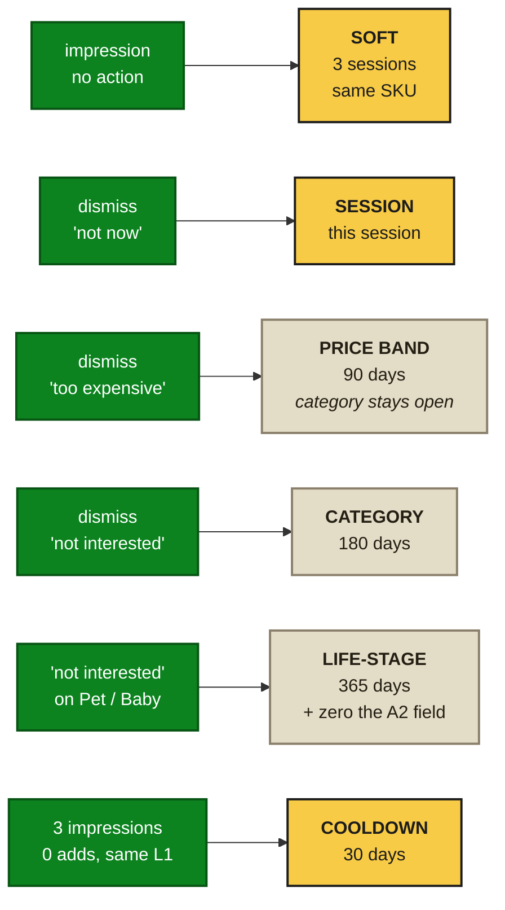

# The Cart Interrupt — Phase-Wise Edge Cases

**Boundary-condition companion to [solution.md](solution.md), [architecture.md](architecture.md), [implementation-plan.md](implementation-plan.md) and [eval.md](eval.md)**
**Status:** Draft — **contains 12 items requiring a spec change** (§2) · **Date:** 2 Aug 2026

---

## 0. Scope and How to Use This

This document catalogues **product, data and user-state boundary conditions** — the situations where a correctly-implemented system still does the wrong thing.

It is deliberately distinct from three neighbours:

| Document | Covers | Not here |
|---|---|---|
| `architecture.md` §11 | **Infrastructure** failures — Valkey down, worker lag | ✓ |
| `solution.md` §11 | **Programme** risks — coverage too low, novelty misread | ✓ |
| `eval.md` §9 | **Evaluation** failure modes — how the measurement lies | ✓ |
| **`edgecases.md`** | **The system working as specified, and the specification being wrong for this input** | — |

### 0.1 Case format

Every case carries an ID, a trigger, what the current spec does, what it should do, and how we would find out.

### 0.2 Status classification

| Status | Meaning |
|---|---|
| **HANDLED** | Current spec covers it. Needs a regression test, nothing more |
| **GAP** | **Current spec produces the wrong behaviour. Requires a change to `solution.md` or `architecture.md`** |
| **ACCEPTED** | Known, documented, deliberately not fixed. Revisit condition stated |
| **OPEN** | Needs a decision from a named owner before the phase it belongs to |

---

## 1. Cross-Cutting Invariants

Four rules that resolve whole classes of edge case at once. Where a case below says "covered by Invariant N", this is what it means.

| # | Invariant | Resolves |
|---|---|---|
| **I1** | **When in doubt, show nothing.** Ambiguity resolves to 204, never to a guess | Every unknown-state case |
| **I2** | **Every fact shown to a user is revalidated at the moment of action.** Price, stock and eligibility are checked at ADD, not only at decision time | Staleness between decision and tap |
| **I3** | **A dismissal is stronger evidence than an impression.** Negative signals decay slower than positive ones | Life-stage and preference cases |
| **I4** | **Absence of data is not evidence of absence.** A missing history, profile or label suppresses; it never permits | Cold start, sparse users, new stores |

**I4 is the one most likely to be violated under pressure.** F1 asks "has this user purchased in this L1 in 365 days?" A user with *no history at all* answers "no" to every category — and a naive reading makes them maximally eligible. That is precisely backwards, and it is EC-P1-01 below.

---

## 2. Summary of Required Spec Changes

The twelve **GAP** items, collected so they can be triaged in one pass. Each is expanded in its phase section.

| ID | Gap | Change needed in | Sev |
|---|---|---|---|
| **EC-P1-01** | Zero-history user is maximally eligible under F1 | `solution.md` §5.2 — new gate F14 | **High** |
| **EC-P1-02** | `cart_subtotal` pre- or post-discount is undefined; F3 and F8 both depend on it | `solution.md` §5.2 | **High** |
| **EC-P1-06** | Prefetch systematically fails on slow networks → biased experiment population | `architecture.md` §13.1 + `eval.md` reporting | **High** |
| **EC-P1-09** | Guest / unauthenticated sessions have no `user_id` for assignment or F1 | `solution.md` §8.1 | Med |
| **EC-P1-11** | Price change between decision and ADD is not revalidated (stock is) | `architecture.md` §9 | **High** |
| **EC-P2-01** | A2 life-stage inferences never decay — pet loss, pregnancy loss | `solution.md` §5.6.2 | **High** |
| **EC-P2-02** | Copy bank is English-only; the app is multilingual | `solution.md` §6.3 + `architecture.md` §13.0 | **High** |
| **EC-P2-05** | Dismissal cooldown of 30 days is too short for life-stage categories | `solution.md` §5.2 (F5) | Med |
| **EC-P2-08** | Reason-line grammar is category-dependent and unvalidated per category | `eval.md` §4.4 | Med |
| **EC-P4-03** | Taxonomy change invalidates F1 history and all 112 bandit arms | `architecture.md` §3.2 | Med |
| **EC-P5-02** | New dark store has no 30-day velocity → F11 blocks everything → zero coverage | `solution.md` §5.2 (F11) | Med |
| **EC-P1-13** | Dynamic Type / large accessibility fonts break the 40-char single-line layout | `solution.md` §6.1 | Med |

---

## 3. Phase 0 — Data and Filter Boundaries

Found in shadow, before anything renders. Cheapest place in the programme to discover them.

### 3.1 Filter boundary conditions

| ID | Trigger | Required behaviour | Status |
|---|---|---|---|
| **EC-P0-01** | User purchased in L1 exactly 365 days ago, to the hour | Define the boundary as `>= now - 365d` inclusive, evaluated in **IST**, not UTC | HANDLED — needs test |
| **EC-P0-02** | `cart_subtotal` exactly ₹149 (F8 floor) and exactly 15% of it (F3 ceiling) | Both gates are `>=` / `<=` inclusive. Written once in `types.py`, not per-filter | HANDLED |
| **EC-P0-03** | Candidate price exactly ₹149 with cart subtotal ₹1,000 | `min(14900, 0.15 × subtotal)` → ₹149 passes | HANDLED |
| **EC-P0-04** | `available_qty` exactly 3 (F2 buffer) | Inclusive — 3 passes, 2 fails | HANDLED |
| **EC-P0-05** | Store velocity exactly 20 units/30d (F11) | Inclusive | HANDLED |
| **EC-P0-06** | Candidate passes every filter but its L1 is in `discovery.paused_l1` | Paused list is checked **last and independently**, so a pause is never defeated by an earlier short-circuit | HANDLED |
| **EC-P0-07** | Two candidates tie exactly on every scoring term | Deterministic tiebreak on `sku_id` ascending. Never random — it would break golden-corpus determinism | HANDLED |
| **EC-P0-08** | Zero candidates survive; every one dropped by a different filter | `interrupt_eligible` still fires with the full drop histogram | HANDLED |

### 3.2 Data quality

| ID | Trigger | Required behaviour | Status |
|---|---|---|---|
| **EC-P0-09** | SKU present in catalogue with `margin_pct` NULL | Treat NULL as **fail** F10, not as zero or as pass (Invariant I4) | HANDLED |
| **EC-P0-10** | SKU listed in two L1 categories | Pool build asserts one L1 per SKU; violations logged and the SKU excluded | GAP-adjacent — assert in P0-6 |
| **EC-P0-11** | Duplicate product under two `sku_id`s, one in cart, one suggested | F4 compares L2 + normalized name, not only `sku_id` | HANDLED — strengthen F4 |
| **EC-P0-12** | SKU name contains 200 chars, emoji, or injection text | Length-capped to 80, control chars stripped, before entering any prompt or any UI | HANDLED — `architecture.md` §3.8 |
| **EC-P0-13** | Historical cart data missing L2 grain for older months | Coverage computed only on the window where grain is complete; window stated in the report | HANDLED |
| **EC-P0-14** | A user appears in `user_category_history` with a purchase count of 0 | Row should not exist. Assert and drop | HANDLED |

### 3.3 The one to look for in shadow

> **EC-P0-15 — Coverage is not uniform across cart types.** Aggregate coverage of 60% can conceal that grocery-only carts (the exact target) sit at 30% while already-diverse carts sit at 90%. **Report coverage segmented by cart composition**, not only in total — otherwise Phase 0 passes on the strength of the users who least need the feature.

---

## 4. Phase 1 — Serving, Client and Race Conditions

### 4.1 User-state cases

| ID | Trigger | Current spec does | Required | Status |
|---|---|---|---|---|
| **EC-P1-01** | **Brand-new user, zero purchase history** | F1 marks **every** L1 as new → maximally eligible | **Suppress.** A first-time user has no replenishment loop to interrupt; the entire premise of the feature does not apply. Add gate **F14 `TENURE_GATE`: ≥3 completed orders and ≥14 days tenure** | **GAP** |
| **EC-P1-02** | **`cart_subtotal` definition undefined** | F3 and F8 both read it; pre-discount and post-discount differ materially, and a coupon can drop a cart below the F8 floor mid-session | **Define as post-discount, pre-delivery-fee**, computed once and passed into `CartContext`. Never recomputed inside a filter | **GAP** |
| **EC-P1-03** | User has purchased in all 28 L1s | Zero candidates → permanent 204 | Correct. These are already the cross-category users the programme wants. Log as `saturated`, exclude from the denominator in coverage reporting | HANDLED |
| **EC-P1-04** | Dormant user returns after 400 days | F1's 365d window makes every category look "new" again | Correct in spirit, but their `household_state` is stale. **Suppress for the first 2 orders after a >180d gap**, then resume | ACCEPTED — implement as part of F14 |
| **EC-P1-05** | Shared household account — two people, one login | A2 profile blends two households; suggestions read as confused | No clean fix without account-level changes. **Accept.** A2 confidence will be low and I4 suppresses the low-confidence fields | ACCEPTED |
| **EC-P1-06** | **Slow network / low-end device — prefetch never returns in 300 ms** | Silent 204 forever for that user | Behaviourally correct, but **statistically dangerous**: it systematically excludes low-end-device users from arms B and C while leaving them in arm A. That is a confounded experiment. **Emit `prefetch_timeout` and exclude timed-out users from the analysis frame in all arms** | **GAP** |
| **EC-P1-07** | User has two accounts in the same household, landing in different arms | Cross-arm contamination | Unfixable without identity resolution. **Accept and document** — the effect dilutes measured lift toward zero, so it is conservative | ACCEPTED |
| **EC-P1-08** | Employee / test / internal account | Appears in experiment data | Exclude by account flag before assignment | HANDLED |
| **EC-P1-09** | **Guest or unauthenticated session** | No `user_id` → cannot hash-assign, cannot evaluate F1 | **Exclude entirely.** No slot, no assignment, not in any denominator. Requires an explicit branch, not an accidental null-hash | **GAP** |
| **EC-P1-10** | User in holdout buckets 95–99 receives a slot | Bug | **P1 alert.** Holdout contamination invalidates the long-run read. Assert in `discovery-api` as well as in assignment — defence in depth | HANDLED — needs the second assert |

### 4.2 Cart and timing races

| ID | Trigger | Required behaviour | Status |
|---|---|---|---|
| **EC-P1-11** | **Price changes between decision computation and ADD tap** (promo ends, surge) | Stock is revalidated at ADD; **price is not**. User sees ₹99 and is charged ₹129. **Revalidate price at ADD; if changed, drop the suggestion silently rather than re-rendering a new price** | **GAP** |
| **EC-P1-12** | Suggested SKU goes OOS between decision and tap | F2's buffer of 3 plus ADD-time revalidation; fail with "just went out of stock" | HANDLED |
| **EC-P1-13** | **Accessibility: Dynamic Type at maximum size** | 40-char reason line wraps to 3 lines; card height doubles; bill summary pushed below fold | **Reason line truncates with ellipsis at 2 lines, or is hidden entirely above a font-scale threshold.** The card must never grow beyond its reserved height | **GAP** |
| **EC-P1-14** | Cart mutated after prefetch, before cart opens | Decision is keyed to `cart_hash`; the client compares its cached hash to the current cart and **discards on mismatch** | HANDLED |
| **EC-P1-15** | Cart fully cleared between prefetch and open | Empty cart fails F8; client discards | HANDLED |
| **EC-P1-16** | User adds on phone, opens cart on tablet | Prefetch lives in the phone's memory; tablet gets nothing | ACCEPTED — a missing suggestion is invisible |
| **EC-P1-17** | User changes delivery location mid-session | `store_id` changes → candidate pool invalid → cache key mismatch → 204 | HANDLED |
| **EC-P1-18** | App backgrounded mid-prefetch, foregrounded 20 min later | Decision TTL (15 min) expired → 204 | HANDLED |
| **EC-P1-19** | Flag flipped off while a user is on the cart screen | Already-rendered slot stays until navigation. Acceptable — it was a valid decision when made | ACCEPTED |
| **EC-P1-20** | Screen reader traversal | Slot announced as one group with a clear label; dismiss control reachable and labelled; ADD announces the item name and price | HANDLED — needs a11y test |
| **EC-P1-21** | Suppression counters lag after an event-pipeline backlog | F5/F6 undercount → user over-exposed | **Fail conservative:** if the suppression store is stale beyond 1 hour, treat every user as suppressed | HANDLED |
| **EC-P1-22** | Midnight IST boundary on `impressions_7d` | Rolling 168-hour window, not calendar days | HANDLED |

---

## 5. Phase 2 — AI Layer, Copy and Dignity

The highest-stakes section. Several of these are not correctness bugs; they are situations where a technically correct suggestion is unkind.

### 5.1 Stale inference — the class that matters most

| ID | Trigger | Required behaviour | Status |
|---|---|---|---|
| **EC-P2-01** | **A2 inferred `pet = dog` or `infant_present = true`, and the user's circumstances have changed** — the pet died, the pregnancy ended, the child grew up | Current spec has **no decay**. The profile persists as long as the purchase history window holds it, so the system can keep surfacing pet or baby suggestions to someone for whom that is painful. **A4/F13 cannot catch this** — the cart looks entirely ordinary | **GAP — highest severity in this document** |

**Required resolution, three parts:**

1. **Decay.** Every life-stage inference carries a `last_corroborated_at`. With no corroborating purchase in **60 days**, confidence decays; at 90 days the field reverts to `unknown`.
2. **Dismissal is decisive.** A dismissal in a life-stage category (Pet, Baby) with reason "not interested" sets a **365-day suppression** on that L1 and immediately zeroes the corresponding A2 field. One signal, not three.
3. **Never re-derive from a single purchase.** Re-establishing a life-stage inference requires ≥2 purchases ≥14 days apart — a one-off gift purchase must not re-open the category.

This is Invariant I3 doing real work: the cost of wrongly stopping is one lost impression; the cost of wrongly continuing is a weekly reminder of a loss.

### 5.2 Language and copy

| ID | Trigger | Required behaviour | Status |
|---|---|---|---|
| **EC-P2-02** | **App is set to Hindi (or any non-English locale); the copy bank is English-only** | Mixed-language UI — an English reason line inside a Hindi card. **Two options: generate the copy bank per supported locale (the rulebook design makes this affordable — it is N× a finite set), or suppress the reason line entirely in non-English locales.** Recommend per-locale generation for the top 2 languages, suppression elsewhere. **Human review is required per language** — a reviewer who does not read the language cannot approve its copy | **GAP** |
| **EC-P2-08** | **Reason-line grammar is category-dependent** — "Goes with the wipes you buy" reads naturally; the same template over a mass noun or a transliterated category may not | Evaluate copy **per L1 category**, not only in aggregate. Add a per-category naturalness floor to `eval.md` §4.4 | **GAP** |
| **EC-P2-03** | Template token fails to resolve → "Goes with your {category}" | Publish-time validator rejects any line containing unresolved braces. Already a Tier 1 check — add the explicit brace pattern | HANDLED |
| **EC-P2-04** | Two different cells produce identical copy for adjacent categories | Harmless. Dedup within a session only | ACCEPTED |

### 5.3 Suppression semantics

| ID | Trigger | Required behaviour | Status |
|---|---|---|---|
| **EC-P2-05** | **User dismisses "Pet Care" three times with "not interested"** | F5 gives a 30-day cooldown, then tries again. For a preference statement ("I have no pet"), 30 days is too short and reads as not listening | **Introduce a suppression ladder** (§5.4). Explicit "not interested" on a life-stage category → 365 days | **GAP** |
| **EC-P2-06** | User dismisses with "too expensive" | Different signal entirely — suppress the **price band**, not the category. Retry the same L1 with a cheaper candidate | HANDLED — reason codes must branch |
| **EC-P2-07** | User dismisses with "not now" | Weakest signal. Session-only suppression | HANDLED |

### 5.4 The suppression ladder

**The asymmetry is the point.** Positive signals (an impression with no action) decay in days; negative signals (an explicit statement of preference) persist for months. A system that forgets a "no" faster than it forgets a "maybe" is a system that nags.

### 5.5 Rulebook edge cases

| ID | Trigger | Required behaviour | Status |
|---|---|---|---|
| **EC-P2-09** | Rulebook references an L1 that has since been delisted | Applier drops unknown L1s and logs; never errors | HANDLED |
| **EC-P2-10** | A2 confidence lands exactly on 0.60 | Inclusive — 0.60 is trusted. Written once | HANDLED |
| **EC-P2-11** | Rulebook republished mid-session; user refreshes and sees different copy | Acceptable. Decision cache TTL bounds it to 15 min | ACCEPTED |
| **EC-P2-12** | Every candidate in a cell is blocked by F13 | Cell yields nothing → 204. Correct — fail closed | HANDLED |
| **EC-P2-13** | A4 blocks >50% of one L1's candidates | Alert. Either the rules are over-broad or the category should not be in scope | HANDLED |

### 5.6 Dignity cases beyond A4's cart-level view

A4 inspects the **current cart**. These are cases where the cart looks ordinary and the harm comes from context A4 cannot see.

| ID | Situation | Required behaviour | Status |
|---|---|---|---|
| **EC-P2-14** | User bought pregnancy test 3 months ago, no baby purchases since | Do not infer `infant_present`; do not surface Baby Care. Covered by the §5.1 corroboration rule (≥2 purchases ≥14 days apart) | HANDLED via EC-P2-01 fix |
| **EC-P2-15** | User's basket shows fasting-period staples | Occasion rules must not surface conflicting food items during observance windows. Merchandiser-maintained calendar, not inferred | OPEN — owner: Merchandiser, before P2 |
| **EC-P2-16** | User regularly buys diabetes medication | Never surface confectionery as a *new category* suggestion. Requires an L2-level exclusion pair, not a cart-level rule | OPEN — owner: PM + Legal, before P2 |
| **EC-P2-17** | User buys allergy medication regularly | Same pattern as EC-P2-16 | OPEN |

**EC-P2-15 through 17 are open on purpose.** They need a standing exclusion table maintained by humans, and inventing its contents here would be worse than naming the owner and the deadline.

---

## 6. Phase 3 — Slot B and Follow-On Orders

| ID | Trigger | Required behaviour | Status |
|---|---|---|---|
| **EC-P3-01** | User taps Slot B add 30 seconds before delivery arrives | Follow-on order created for a *second* delivery. Show the delivery-fee implication **before** confirming | HANDLED — must be in the design |
| **EC-P3-02** | Follow-on order falls below the minimum order value | Either block the add or state the shortfall. Never create an order that cannot be fulfilled | HANDLED |
| **EC-P3-03** | User taps Slot B, then cancels the original order | Follow-on is independent; it survives. Correct but potentially surprising — confirm copy makes independence clear | ACCEPTED |
| **EC-P3-04** | Delivery completes while the tracking screen is open | Slot B disappears on state transition; an in-flight add still completes as a follow-on | HANDLED |
| **EC-P3-05** | User has an active order and opens tracking for an older one | Slot B renders only for the most recent active order | HANDLED |
| **EC-P3-06** | Two follow-on orders created in one session | F6 fatigue cap applies to Slot B impressions independently of Slot A | HANDLED |
| **EC-P3-07** | Rider is delayed; tracking screen open for 40 minutes | Slot B refreshes at most once. A screen open unusually long is more likely frustration than engagement — **do not increase exposure with dwell time** | HANDLED |

**EC-P3-07 is a small decision with an outsized dignity payoff.** The naive design treats a long dwell as more attention; a long dwell on a delivery tracker usually means the delivery is late.

---

## 7. Phase 4 — Ranker and Bandit

| ID | Trigger | Required behaviour | Status |
|---|---|---|---|
| **EC-P4-01** | A bandit arm receives zero impressions for 30 days | Floor allocation guarantees a minimum exploration share; alert if an arm starves | HANDLED |
| **EC-P4-02** | A new L1 category is added to the taxonomy | New arm initialized at Beta(1,1) with the 500-impression trust floor | HANDLED |
| **EC-P4-03** | **An existing L1 is split or merged** | **All F1 history, all affinity edges and all 112 bandit posteriors keyed to that L1 become wrong.** A user who "never bought" the new L1 may have bought its predecessor. Requires a **taxonomy migration procedure**: map old→new, recompute `user_category_history`, reset affected posteriors, invalidate affected rulebook cells | **GAP** |
| **EC-P4-04** | Model artifact fails to load at worker start | Fall back to `ranker_version = v0`, alert. Never start with no ranker | HANDLED |
| **EC-P4-05** | `p_repeat` model has no training data for a rarely-shown category | Fall back to the category prior; do not extrapolate | HANDLED |
| **EC-P4-06** | Feature vector contains a NULL at serving that was never NULL in training | Explicit imputation defined per feature in `features.sql`, identical both sinks | HANDLED |
| **EC-P4-07** | Exploration probability not recorded for a decision | **IPW cannot be computed.** Drop the row from training rather than assume a probability | HANDLED |

---

## 8. Phase 5 — Scale and Regional

| ID | Trigger | Required behaviour | Status |
|---|---|---|---|
| **EC-P5-01** | Store carries fewer than 3 eligible SKUs across all L1s | Store is ineligible. Report the ineligible-store count per city — it is a merchandising signal | HANDLED |
| **EC-P5-02** | **A newly opened dark store has no 30-day velocity history** | F11 requires ≥20 units/30d **or** a curated-launch flag. A new store fails both → **zero coverage for its entire first month**. Add a **store-launch exemption**: for stores <45 days old, inherit velocity from the nearest same-tier store in the same city | **GAP** |
| **EC-P5-03** | Tier-2/3 store assortment is materially narrower | Expected. Report coverage per city tier from Phase 0, never only nationally | HANDLED — `eval.md` §6 |
| **EC-P5-04** | State-specific product restrictions (tobacco, e-cigarettes, alcohol) | F7 exclusions are national; **state-level restrictions must be applied at pool build**, per store | HANDLED — confirm in P5-2 |
| **EC-P5-05** | Regional language becomes dominant in a new city | EC-P2-02's locale decision determines whether the slot renders at all there | Blocked on EC-P2-02 |
| **EC-P5-06** | Valkey memory pressure evicts decision cache entries | 204 spike, no user-visible error. Alert on eviction rate | HANDLED |
| **EC-P5-07** | Thundering herd on flag flip to 100% | Cache warmer pre-populates before the step; ramp is stepped for exactly this reason | HANDLED |
| **EC-P5-08** | Festival window opens mid-ramp | Do not read lift across a festival boundary. Stratify or pause the step | HANDLED — `solution.md` §8.2 |

---

## 9. Phase 6 — Monetization

| ID | Trigger | Required behaviour | Status |
|---|---|---|---|
| **EC-P6-01** | Sponsored candidate is the only survivor of F1–F13 | **Show nothing.** A slot that is sponsored-only whenever organic supply is thin degrades into an ad unit by attrition | HANDLED — enforce as a filter |
| **EC-P6-02** | Advertiser bids on an F7-excluded category | Rejected at pool build. The bid never reaches the ranker | HANDLED |
| **EC-P6-03** | Sponsored item blocked by F13 after billing was counted | Billing counts **verified trials**, not impressions — a blocked item was never served, so nothing is billed | HANDLED |
| **EC-P6-04** | Disclosure label truncated on small screens | Disclosure is never truncated. If it does not fit, the sponsored item does not render | HANDLED |

---

## 10. Accepted Risks

Documented, deliberately unfixed, with the condition that would reopen them.

| ID | Accepted | Why | Reopen if |
|---|---|---|---|
| EC-P1-05 | Shared-account profile confusion | No fix without account-level changes; I4 suppresses low-confidence fields anyway | Household profiles ship |
| EC-P1-07 | Multi-account arm contamination | Dilutes measured lift toward zero — conservative, not misleading | Identity resolution exists |
| EC-P1-16 | Cross-device prefetch miss | A missing suggestion is invisible | Server-side prefetch cache is added |
| EC-P1-19 | Slot persists after flag-off until navigation | It was a valid decision when made | Never |
| EC-P2-04 | Duplicate copy across adjacent cells | Harmless | Users report repetition |
| EC-P2-11 | Copy changes on mid-session refresh | Bounded by a 15-minute TTL | Never |
| EC-P3-03 | Follow-on survives original cancellation | Independent orders are the simpler model | Support tickets appear |

---

## 11. Open Decisions

| ID | Decision needed | Owner | Needed by |
|---|---|---|---|
| **EC-P2-15** | Observance-window exclusion calendar — who maintains it, what it contains | Merchandiser | Before Phase 2 |
| **EC-P2-16** | Health-signal exclusion pairs (e.g. diabetes medication → confectionery) | PM + Legal | Before Phase 2 |
| **EC-P2-17** | Allergy-signal exclusion pairs | PM + Legal | Before Phase 2 |
| **EC-P2-02** | Locale strategy — generate per language or suppress | PM + Designer | Before Phase 2 |
| **EC-P1-01** | F14 tenure thresholds — 3 orders / 14 days, or different | PM + Analyst | Before Phase 1 |

**EC-P2-16 and 17 need care in framing.** The goal is *not* to build a health profile — that is explicitly outside A2's schema. It is a narrow, human-maintained exclusion table: "if this category appears in history, never surface that category as a new-category suggestion." No inference, no storage of a health attribute, no model involvement.

---

## 12. Test Matrix

Where each class of case is tested, mapped to `eval.md`.

| Case class | Level | Suite | Cadence |
|---|---|---|---|
| Filter boundaries (§3.1) | L0 | `l0_unit` | Every commit |
| Data quality (§3.2) | L0 + pool build asserts | `l0_unit` + `pools_job` | Every commit / daily |
| User state (§4.1) | L0 with synthetic profiles | `l0_unit` | Every commit |
| Client races (§4.2) | L2 | mobile integration | Every release |
| Accessibility (EC-P1-13, 20) | L2 | a11y suite | Every release |
| Stale inference (§5.1) | L1 | `a2_decay` | Nightly |
| Copy per locale/category (§5.2) | L1 | `a3_copy` per-segment | Every publish |
| Suppression ladder (§5.4) | L0 | `l0_unit` | Every commit |
| Dignity cases (§5.6) | L1 | A4-RED, extended | Every publish |
| Slot B flows (§6) | L2 | E2E staging | Every release |
| Ranker/bandit (§7) | L1 | `l1_components` | Nightly |
| Regional (§8) | L1 + reporting | coverage by tier | Weekly from P5 |

**Every case in this document becomes a named test.** An edge case documented but untested is a comment, and comments do not survive refactors.

---

*New edge cases are appended, never renumbered. Anything discovered in production is added the same working day (`eval.md` §11.1) and, if it is a GAP, raised as a spec change rather than patched in the caller.*
