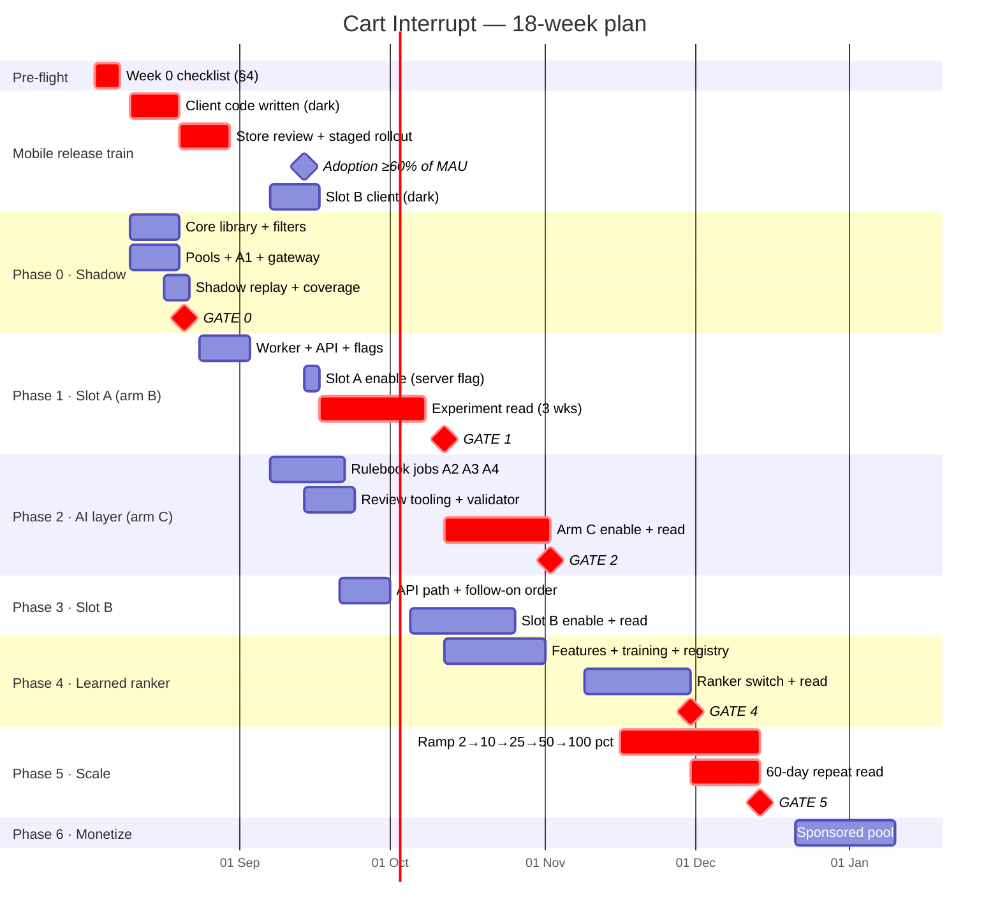

# The Cart Interrupt — Phase-Wise Implementation Plan

**Execution companion to [solution.md](solution.md) and [architecture.md](architecture.md)**
**Status:** Draft for squad + stakeholder sign-off · **Date:** 2 Aug 2026
**Proposed start:** Week 0 = Mon 3 Aug 2026 · Week 1 = Mon 10 Aug 2026

---

## 0. How the three documents fit

| Document | Answers | Owner |
|---|---|---|
| `solution.md` | *What* we are building and *why*. Filters, rankers, AI layer, experiment design, decision criteria | PM |
| `architecture.md` | *How it is built.* Components, contracts, data model, stack, failure modes | Tech Lead |
| **`implementation-plan.md`** | ***Who* does *what*, *when*, and *what has to be true* to proceed** | PM + Tech Lead |

This document adds nothing to the design. If a conflict appears, `solution.md` wins on product behaviour and `architecture.md` wins on technical structure — file a correction here rather than diverging.

---

## 1. The Scheduling Insight

**Total engineering effort is ~174 engineer-days — roughly 7 weeks for a 5-person squad. The calendar is 18 weeks.**

The gap is not slack. It is **measurement**, and it is irreducible:

- Every experiment read needs **≥3 weeks** (`solution.md` §8.2) because a novel UI element inflates engagement in week 1 and typically decays by week 3
- The Phase 5 exit gate needs **60-day repeat data**, which only exists ~8.6 weeks after the first cohort is exposed
- Guardrail reads need a **full weekly cycle** including a weekend

Three consequences that shape the entire plan:

1. **Build the next phase during the current phase's read.** This is why phases overlap in the Gantt. A squad idle during a measurement window is a planning failure.
2. **Never shorten a read to hit a date.** Reading Phase 1 at day 4 will produce a confident wrong answer and an expensive rollback. This is the single most likely way this project fails.
3. **The first cohort is the most valuable one**, because it is the only cohort that reaches its 60-day mark before the scale decision. Phase 1 launching on time matters more than Phase 1 launching complete.

---

## 2. Squad and Roles

### 2.1 Core squad

| Role | Allocation | Owns |
|---|---|---|
| **PM** | 100% | Gate decisions, metric definitions, decision log, stakeholder comms |
| **Tech Lead** | 100% | Architecture integrity, parity discipline, code review, on-call rota |
| **Backend 1** | 100% | `discovery-core`, filters, worker |
| **Backend 2** | 100% | `discovery-api`, gateway, flags, guardrail monitor |
| **Data/ML** | 100% | Pools, A1–A4, rulebooks, learned ranker, calibration |
| **Mobile iOS** | 60% | Prefetch, Slot A, Slot B |
| **Mobile Android** | 60% | Prefetch, Slot A, Slot B |

### 2.2 Part-time and consulted

| Role | When | Owns |
|---|---|---|
| **Designer** | P0–P1, P3 | Slot A/B specs, copy principles, layout-shift review |
| **Data Analyst** | Every gate | Experiment readouts, power checks, holdout integrity |
| **Merchandiser** | Weekly from P0 | A1 affinity pair review, copy bank review, category pauses |
| **Legal / Privacy** | Week 0, P2 | F7 exclusion sign-off, A2 inference consent review |
| **Fulfilment** | P3 only | Follow-on order flow confirmation |

### 2.3 RACI on the decisions that matter

| Decision | R | A | C | I |
|---|---|---|---|---|
| Ship / no-ship at each gate | PM | PM | Tech Lead, Analyst | Squad, stakeholders |
| F7 exclusion list contents | PM | **Legal** | Merchandiser | Squad |
| A1 affinity pair approval | Data/ML | **Merchandiser** | PM | Squad |
| Copy bank publication | Data/ML | **PM** | Designer, Legal | Squad |
| Auto-rollback thresholds | Tech Lead | PM | Analyst | Squad |
| Deleting A3 if arm C ≤ arm B | PM | PM | Data/ML, Analyst | Squad |
| Escalating to Solution 1 | **PM** | Head of Growth | Merchandiser | Squad |

---

## 3. Master Timeline



### 3.1 Critical path

```
Week 0 legal + baseline
   └─▶ Mobile client dark ship ──▶ store review ──▶ adoption ≥60%   ← LONGEST LEAD
   └─▶ P0 coverage gate
          └─▶ P1 server enable ──▶ 3-week read ──▶ GATE 1
                 └─▶ P2 arm C ──▶ 3-week read ──▶ GATE 2
                        └─▶ P5 ramp ──▶ 60-day repeat ──▶ GATE 5
```

**Mobile is the longest-lead item, not the backend.** Client code takes ~2 weeks to write, then store review and staged rollout take another ~2 weeks, then adoption has to reach a level where the experiment is powered. Total ~5–6 weeks from first commit to usable population.

**Therefore: mobile work starts in Week 1, not Phase 1, and ships dark.** The client code is behind a server flag from day one, so Phase 1's "launch" is a flag flip on an already-deployed app. Getting this wrong adds a month to the plan and is the most common way plans like this slip.

### 3.2 App-version gating — a constraint that must reach the analysis

The experiment population is **users on app version ≥ the release carrying the prefetch code**. Two implications the Analyst must handle:

1. **Assignment must be conditioned on app version.** A user on an old build cannot be in arm B or C, and must not be counted in arm A either — they are outside the experiment frame entirely.
2. **Updaters are not a random sample.** They skew toward more engaged users. Report the arm comparison within the eligible population only, and state the eligible-population share in every readout.

Do not start the 3-week read until adoption clears **60% of MAU** on the eligible build.

---

## 4. Week 0 — Pre-Flight Checklist

Nothing below is engineering. All of it blocks Week 1 and all of it has external lead time.

| # | Item | Owner | Blocks | Done when |
|---|---|---|---|---|
| 1 | **Legal sign-off on F7 exclusion list** (`solution.md` §5.2) | PM → Legal | P1 launch | Written approval, list frozen in repo |
| 2 | **A2 inference privacy review** — is basket-derived household inference covered by current consent language? | PM → Privacy | P2 only | Written opinion |
| 3 | **Baseline FPNC-30 pull** — the metric the whole experiment is sized against | PM → Analytics | Gate 0 | Number + methodology documented |
| 4 | **Book the mobile release train slot** | Tech Lead → Mobile leads | Everything | Slot confirmed for Week 3 cut |
| 5 | **Confirm Groq free-tier RPM/TPM** (`architecture.md` §13.10) | Data/ML | P0 A1 job | Limits documented, token bucket sized |
| 6 | **Provision the VM + Valkey + DuckDB** | Backend 2 | Week 1 | `staging` reachable, healthcheck green |
| 7 | **Repo, CI, branch protection** | Tech Lead | Week 1 | CI green on empty scaffold |
| 8 | **Confirm which internal equivalents already exist** (feature store, experiment platform, event bus) | Tech Lead | P0 scoping | Decision recorded per component |
| 9 | **Merchandiser named and booked** for weekly review | PM | P0 A1 gate | Recurring invite accepted |
| 10 | **Agree the decision log location and format** | PM | Gate 0 | First entry written |

> **If items 1, 3 or 4 are not done by end of Week 0, the start date moves.** Do not begin Week 1 hoping they land in parallel — items 1 and 4 have gatekeepers outside the squad and historically slip.

---

## 5. Phase 0 — Instrument and Shadow

**Weeks 1–2 (10 Aug – 21 Aug) · No user-facing code · ~36 engineer-days**

### Objective

Answer three questions before a pixel is designed: is there anything eligible to show, can A1 reproduce known affinities, and is `cart_sig` cardinality low enough for the rulebook approach to work.

### Workstreams

| ID | Task | Owner | Est. | Depends on |
|---|---|---|---|---|
| **P0-1** | Repo scaffold, CI, branch protection, pre-commit | Tech Lead | 2d | W0-7 |
| **P0-2** | `core/types.py` — `CartContext`, `Candidate`, `Decision`, `DropReason` | BE1 | 2d | P0-1 |
| **P0-3** | `core/candidates.py` — CG1, CG5 | BE1 | 3d | P0-2 |
| **P0-4** | `core/filters.py` — F1–F14, each an independently testable predicate (incl. F14 TENURE_GATE & post-discount subtotal) | BE1 | 5d | P0-2 |
| **P0-5** | `core/scoring.py` v0 rules | BE1 | 1d | P0-3, P0-4 |
| **P0-6** | `offline/pools_job` — `store_candidate_pool` (with store-launch velocity fallback), `user_category_history` in DuckDB | Data/ML | 4d | W0-6 |
| **P0-7** | `llm-gateway` — Ollama + Groq routing, cache, token bucket, usage log | BE2 | 3d | W0-5 |
| **P0-8** | `offline/a1_affinity_job` + calibration harness | Data/ML | 5d | P0-7 |
| **P0-9** | `discovery-shadow` batch replay over 30d history | BE2 | 3d | P0-5, P0-6 |
| **P0-10** | `discovery-shadow` stream tap | BE2 | 2d | P0-9 |
| **P0-11** | Event schema — all of `solution.md` §7, deployed even where nothing emits yet | BE2 | 3d | P0-1 |
| **P0-12** | Golden corpus (1,000 carts) + parity harness | Tech Lead | 3d | P0-5 |
| **P0-13** | F7 exhaustive exclusion test | BE1 | 1d | P0-4 |
| **P0-14** | Coverage report generator (Appendix C table) | Data/ML | 2d | P0-9 |
| **P0-15** | **Mobile: prefetch client + Slot A shell, behind server flag** | iOS, Android | 8d | Design spec |
| **P0-16** | Design: Slot A spec, states, copy principles | Designer | 4d | — |

**P0-15 is in Phase 0 deliberately.** It is Phase 1 functionality, but it must catch the Week 3 release train (§3.1). Ship it dark.

### Deliverables

1. `discovery-core` v0.1, unit-tested, no I/O
2. Coverage report: % of carts with ≥1 eligible candidate, by city and L1
3. A1 calibration report as a build artifact
4. `cart_sig` cardinality analysis
5. Drop-reason histogram
6. Client code merged and in the release train, dark

### Definition of Done

- [ ] CI green including F7 exhaustive test and golden-corpus parity
- [ ] `discovery-core` has zero imports of network, clock or global RNG (enforced by lint rule)
- [ ] Coverage report reproducible by a single command
- [ ] A1 calibration number published, not just logged
- [ ] Mobile client merged to the release branch

### Gate 0 — Fri 21 Aug

**Attendees:** PM, Tech Lead, Data/ML, Analyst, Merchandiser, Head of Growth

| Check | Threshold | Source |
|---|---|---|
| Coverage | **≥ 60%** | P0-14 |
| A1 calibration error | **≤ 0.15** | P0-8 |
| `cart_sig` cardinality → projected rulebook coverage | **≥ 80%** | P0-9 |
| Drop-reason histogram | Explicable, no single filter >90% | P0-14 |
| Baseline FPNC-30 | Documented | W0-3 |

**Decision options — all three are legitimate outcomes:**

| Coverage | Decision |
|---|---|
| ≥ 60% | **Proceed to Phase 1** |
| 40–60% | **Proceed, narrowed** — restrict to the L1 categories that clear depth ≥3, and open a parallel merchandising workstream |
| **< 40%** | **Stop. Escalate to Solution 1.** Do not loosen F3 to manufacture candidates |

> The < 40% branch is pre-committed here specifically so that, in the room, it is a plan being followed rather than a project being cancelled. Two weeks that redirect the roadmap to the right problem is the best possible return on Phase 0.

### Risks

| Risk | Trigger | Owner | Response |
|---|---|---|---|
| Coverage below 40% | P0-14 output | PM | Execute the stop branch; Solution 1 business case within 1 week |
| A1 calibration > 0.30 | P0-8 | Data/ML | Ship co-occurrence-only CG2; A1 deferred, not blocking |
| Mobile misses release train | Week 2 cut | Tech Lead | Phase 1 slips 2 weeks. **No workaround** — this is why it is Week 0 item 4 |
| Historical cart data unavailable at L2 grain | P0-6 | Data/ML | Fall back to stream tap only; coverage read takes 1 extra week |

---

## 6. Phase 1 — Slot A, Deterministic (Arm B)

**Weeks 3–5 build, read completes Week 9 · ~47 engineer-days**

### Objective

Prove the surface renders, converts, and does not harm checkout — establishing the baseline the AI layer must beat.

### Workstreams

| ID | Task | Owner | Est. | Depends on |
|---|---|---|---|---|
| **P1-1** | `discovery-worker` — Valkey Streams consumer, core call, cache write, decision log | BE1 | 5d | P0-5 |
| **P1-2** | `discovery-api` — `GET /v1/discovery/slot`, slot policy, 204 semantics | BE2 | 3d | P0-5 |
| **P1-3** | Flag service — JSON in git → Valkey mirror, hot reload | BE2 | 2d | — |
| **P1-4** | Experiment assignment — deterministic hashing, reserved holdout buckets | BE2 | 2d | P1-3 |
| **P1-5** | Suppression pipeline — F5/F6 counters from events | BE1 | 3d | P0-11 |
| **P1-6** | `guardrail-monitor` — §8.4 triggers every 5 min, flag flip | BE2 | 4d | P1-3 |
| **P1-7** | Slot A UI finalization, both platforms | iOS, Android | 8d | P0-15, P0-16 |
| **P1-8** | Dismiss affordance + reason capture | iOS, Android | 3d | P1-7 |
| **P1-9** | Shadow/live parity test in CI | Tech Lead | 3d | P1-1 |
| **P1-10** | Chaos suite — Valkey down, API down, late prefetch | Tech Lead | 3d | P1-2 |
| **P1-11** | Layout-shift test — assert late response discarded, never inserted | iOS, Android | 2d | P1-7 |
| **P1-12** | Guardrail dashboard + alerting | BE2, Analyst | 3d | P1-6 |
| **P1-13** | Rollback drill — rehearsed, timed, documented | Tech Lead | 1d | P1-6 |

### Launch sequence

| Step | When | Action |
|---|---|---|
| 1 | App adoption ≥60% MAU | Confirm eligible population size |
| 2 | Day 1 | `discovery.enabled = true`, `traffic_pct = 0.5`, 1 city — **smoke test only** |
| 3 | Day 2 | Guardrail read. If clean → `traffic_pct = 2.0`, 2 cities |
| 4 | Day 2–23 | **3-week read. No changes to the arm during the window.** |
| 5 | Day 23 | Gate 1 |

**No configuration changes during the read window.** Changing the price ceiling or the arm split mid-read invalidates it and the 3 weeks start again. Write this on the dashboard.

### Definition of Done

- [ ] Parity test green and release-blocking
- [ ] Chaos suite green — all three failures render a normal cart
- [ ] Rollback drill rehearsed end-to-end in under 5 minutes
- [ ] Guardrail dashboard live with alerting to on-call
- [ ] Holdout bucket integrity verified by Analyst (users in 95–99 receive nothing)

### Gate 1 — Mon 12 Oct

| Check | Threshold |
|---|---|
| Checkout CVR | No movement outside noise |
| Cart→order median time | No regression |
| Add-rate on Slot A | **≥ 3%** |
| P1 incidents | **Zero** |
| Holdout integrity | Verified |

**Decision options:** proceed to arm C · iterate on Slot A placement/copy and re-read · kill if any guardrail breached at significance.

### Risks

| Risk | Trigger | Owner | Response |
|---|---|---|---|
| Checkout CVR regression | Guardrail monitor | Tech Lead | Auto-rollback fires; post-mortem before any re-enable |
| Add-rate < 1% | Week 1 read | PM, Designer | Do **not** change mid-read. Log for Gate 1, consider placement change as a new read |
| Adoption stalls below 60% | Week 5 | Mobile leads | Delay read start; do not run underpowered |
| Novelty effect misread | Week 1 optimism | PM | Pre-committed: no decisions before day 21 |

---

## 7. Phase 2 — The AI Layer (Arm C)

**Weeks 5–8 build, read completes Week 13 · ~36 engineer-days**

Built during Phase 1's read window. This is the overlap §1 depends on.

### Workstreams

| ID | Task | Owner | Est. | Depends on |
|---|---|---|---|---|
| **P2-1** | `offline/a2_rulebook_job` — LLM classifies ~5k history signatures → rulebook | Data/ML | 5d | P0-7 |
| **P2-2** | A2 rulebook applier — maps all users deterministically | Data/ML | 2d | P2-1 |
| **P2-3** | `offline/a3_rulebook_job` — ordering rules + copy bank over ~20k cells | Data/ML | 6d | P2-1 |
| **P2-4** | `offline/a4_rules_job` — ~40 block rules → predicate compiler | BE1 | 4d | P0-7 |
| **P2-5** | `core/validator.py` at publish time — schema, whitelist, deny-list | BE1 | 3d | P2-3 |
| **P2-6** | Rulebook store + versioning + rollback pointer | BE2 | 4d | — |
| **P2-7** | **Copy review tool** — weekly diff vs last version, approve/reject with reasons | BE2 | 4d | P2-3, P2-5 |
| **P2-8** | `offline/cache_warmer_job` | Data/ML | 3d | P2-6 |
| **P2-9** | Worker rulebook application | BE1 | 3d | P2-6 |
| **P2-10** | Validator fuzz suite | Tech Lead | 3d | P2-5 |
| **P2-11** | F13 regression corpus from `solution.md` §5.6.4 | BE1, PM | 2d | P2-4 |
| **P2-12** | Prompt-payload PII assertion test | BE2 | 1d | P2-1 |
| **P2-13** | Arm C assignment enablement | BE2 | 1d | P1-4 |

### The human review loop

**Nothing generated reaches a user without a person reading it.** The weekly cadence:

| Day | Who | Action |
|---|---|---|
| Mon | Data/ML | Regenerate rulebooks, run validator |
| Tue | PM + Designer | Review copy-bank diff — every new or changed line |
| Tue | Merchandiser | Review top-200 affinity pairs and any new A4 block rules |
| Wed | PM | Publish approved version, or hold the previous one |

Rejections are retained with reasons and fed back as negative examples. **A held version is a normal outcome, not an incident** — last week's rulebook stays live and nothing degrades.

### Definition of Done

- [ ] Zero unreviewed copy reachable in production — provable by joining `decision_log.copy_source` to the approved bank
- [ ] Fuzz suite green: every adversarial input rejected at publish, never an exception
- [ ] Chaos: rulebook store deleted → arm C output byte-identical to arm B
- [ ] Rulebook parity: shadow and worker produce identical decisions from the same rulebook
- [ ] Privacy review (W0-2) closed

### Gate 2 — Mon 2 Nov

| Check | Threshold |
|---|---|
| Arm C vs **arm B** on FPNC-30 | **≥ +0.4pp at 95%** |
| Rulebook coverage of cart views | ≥ 70% |
| Unreviewed copy in production | **Zero** |
| Guardrails | Hold |

**Decision options:**

| Outcome | Action |
|---|---|
| C > B by ≥0.4pp | Keep the AI layer, proceed |
| C ≈ B | **Delete A3.** Ship arm B. Keep A1, A2, A4 — they feed candidate generation and safety in both arms |
| C < B | Delete A3, investigate whether generated copy is actively worse than templates |

> Comparing C to A only proves the surface works. **C vs B is the only comparison that tells you whether the intelligence earned its place**, and the plan pre-commits to deleting A3 if it did not.

### Risks

| Risk | Trigger | Owner | Response |
|---|---|---|---|
| Copy review becomes a bottleneck | >2h/week review load | PM | Cap new cells per week; review by sampling within reason-code clusters |
| A2 privacy review returns negative | W0-2 outcome | PM | Ship arm C without A2; A3 falls back to cart-only context |
| Rulebook coverage < 50% | P2-8 output | Data/ML | Widen cell definition (coarser `cart_sig` bands) and regenerate |
| Ollama throughput insufficient | P2-3 runtime | Data/ML | Split generation across nights; A3 is weekly, not daily — there is slack |

---

## 8. Phase 3 — Slot B, Order Tracking

**Weeks 7–9 build, read completes Week 12 · ~16 engineer-days**

### Workstreams

| ID | Task | Owner | Est. | Depends on |
|---|---|---|---|---|
| **P3-1** | `discovery-api` slot B path — 3 items, category tiles, ₹299 ceiling | BE2 | 2d | P1-2 |
| **P3-2** | **Mobile: tracking-screen module, dark ship** | iOS, Android | 8d | Design |
| **P3-3** | Follow-on order flow (§13.6) | BE1 | 4d | P3-1 |
| **P3-4** | Funnel instrumentation `slot_b_add → follow_on_order_completed` | BE2 | 2d | P3-3 |
| **P3-5** | Exploration at 40% for Slot B | BE1 | 1d | P3-1 |
| **P3-6** | Design: Slot B spec | Designer | 3d | — |

**P3-2 ships dark in the Week 7 release train** — same lead-time logic as P0-15.

### Definition of Done

- [ ] Slot B never renders above the map or status timeline
- [ ] Follow-on order completes end-to-end in staging
- [ ] Funnel instrumented before launch, not after

### Gate 3 — Week 12

Guardrails hold · Slot B add-rate measured · no order-cancellation movement · **follow-on completion rate documented** — that number is the business case for ever building the append path.

---

## 9. Phase 4 — Learned Ranker

**Weeks 9–13 build, read completes Week 16 · ~28 engineer-days**

### Workstreams

| ID | Task | Owner | Est. | Depends on |
|---|---|---|---|---|
| **P4-1** | `offline/features.sql` — single definition, dual sink (§13.4) | Data/ML | 5d | — |
| **P4-2** | Feature parity CI test — byte-identical vectors from both sinks | Data/ML | 2d | P4-1 |
| **P4-3** | `p_add` training with **inverse-propensity weighting** | Data/ML | 5d | P4-1 |
| **P4-4** | `p_repeat` training against the never-treated holdout | Data/ML | 4d | P4-1 |
| **P4-5** | Model registry + `ranker_version` flag | BE2 | 3d | P1-3 |
| **P4-6** | `core/scoring.py` v1, in-process load | BE1 | 3d | P4-5 |
| **P4-7** | `offline/posteriors_job` — nightly Beta updates, 112 arms | Data/ML | 3d | P0-11 |
| **P4-8** | Thompson sampling activation | BE1 | 2d | P4-7 |
| **P4-9** | Shadow validation of v1 before any live traffic | Tech Lead | 2d | P4-6 |

### The one thing to get right

**Training labels come from impressions the previous ranker chose.** Both mitigations are mandatory, not optional:

1. `p_add` trained with IPW using the exploration probability recorded per decision
2. `p_repeat` calibrated against the 5% never-treated holdout

Without them the ranker converges on whatever v0 happened to favour and reports it as truth. **P4-3 and P4-4 do not pass review without the correction implemented and its effect shown.**

### Gate 4 — Mon 30 Nov

FPNC-30 lift ≥ **+1.0pp** · feature parity verified · no guardrail movement on ranker switch · IPW correction demonstrated.

---

## 10. Phase 5 — Scale

**Weeks 14–17 · ~11 engineer-days + continuous analysis**

### Ramp schedule

| Step | Traffic | Min duration | Gate before next |
|---|---|---|---|
| 1 | 2% | — | current |
| 2 | 10% | 4 days | Full guardrail read |
| 3 | 25% | 4 days | Full guardrail read + per-city breakdown |
| 4 | 50% | 4 days | Full guardrail read |
| 5 | 100% | — | Gate 5 |

**Every step gets a fresh novelty bump.** A new cohort behaves like week 1 all over again, so read each step's guardrails but do not read its *lift* as the steady state.

### Workstreams

| ID | Task | Owner | Est. |
|---|---|---|---|
| **P5-1** | Capacity — worker scaling, Valkey sizing to §3.5 ×1.5 | Tech Lead | 3d |
| **P5-2** | Regional pool verification — tier-2/3 assortment depth | Data/ML | 3d |
| **P5-3** | Per-city guardrails and per-city auto-rollback scoping | BE2 | 3d |
| **P5-4** | Rulebook coverage extension for new `cart_sig` values | Data/ML | 2d |

**Expect coverage to drop outside the two metro launch cities.** P5-2 should be run *before* the 25% step, not discovered at it.

### Gate 5 — Mon 14 Dec · The real ship decision

| Check | Threshold |
|---|---|
| FPNC-30 lift | ≥ +1.0pp |
| **60-day category repeat rate among converts** | **≥ 25%** |
| Guardrails at 100% | Hold |
| Cost per incremental add | Within contribution margin |

> **The repeat gate is the one that decides what was actually built.** Lift on FPNC with weak repeat means a discount engine, not a discovery engine — and it will not survive contact with the P&L. This gate has veto power over every positive number above it.

---

## 11. Phase 6 — Monetization

**Week 18+ · Scoped after Gate 5**

| ID | Task | Owner |
|---|---|---|
| **P6-1** | CG6 activation | BE1 |
| **P6-2** | Bid term in `S(c)` | Data/ML |
| **P6-3** | Sponsored quality floor **as a filter**, not a score term | BE1 |
| **P6-4** | Cost-per-verified-trial billing integration | BE2 |
| **P6-5** | "Sponsored" disclosure + legal review | PM, Legal |

Not scoped in detail here on purpose. Phase 6 depends on numbers that do not exist yet, and scoping it now would be fiction.

---

## 12. Ways of Working

### 12.1 Cadence

| Ceremony | When | Duration | Output |
|---|---|---|---|
| Standup | Daily 09:45 | 10 min | Blockers only |
| Rulebook review | Tue (from P2) | 60 min | Publish / hold decision |
| Guardrail review | Mon | 30 min | Continue / rollback |
| Gate review | Per §5–§10 | 90 min | Logged decision |
| Retro | End of each phase | 45 min | Actions with owners |

### 12.2 The decision log

One append-only file. Every gate decision, every threshold change, every pre-committed branch taken:

```
DATE | GATE | DECISION | RATIONALE | DATA | DECIDED BY | REVERSIBLE?
```

**Threshold changes require a written entry before the read, never after.** This is the mechanism that stops a disappointing result becoming a moved goalpost, and it is the single cheapest integrity control in the plan.

### 12.3 Definition of Done — every ticket

- [ ] Unit tests, including the failure path
- [ ] Observability: at least one metric or log line
- [ ] Flag-gated if it touches serving
- [ ] Rollback documented
- [ ] `discovery-core` changes carry a golden-corpus diff in the PR

### 12.4 On-call

From Phase 1. Primary + secondary, weekly rotation. **The only P1 condition is "the cart is affected."** Everything else — no suggestions rendering, stale rulebook, gateway down — is a P3 handled next working day, because by design none of it touches the cart.

---

## 13. Consolidated Risk Register

| # | Risk | Phase | Sev | Owner | Trigger | Response |
|---|---|---|---|---|---|---|
| 1 | Coverage < 40% | P0 | **High** | PM | Gate 0 | Stop, escalate Solution 1 |
| 2 | Mobile misses release train | P0 | **High** | Tech Lead | Week 2 cut | 2-week slip, no workaround |
| 3 | Legal F7 sign-off delayed | W0 | **High** | PM | End Week 0 | Start date moves |
| 4 | Checkout CVR regression | P1 | **High** | Tech Lead | Guardrail | Auto-rollback + post-mortem |
| 5 | Read shortened under date pressure | P1, P2 | **High** | PM | Any request | Refuse. Cite §1 and the decision log |
| 6 | Arm C ≤ arm B | P2 | Med | PM | Gate 2 | Delete A3 — pre-committed, not a failure |
| 7 | Copy review bottleneck | P2 | Med | PM | >2h/week | Cap new cells, sample within clusters |
| 8 | A2 privacy review negative | P2 | Med | PM | W0-2 | Ship arm C without A2 |
| 9 | Feedback loop biases ranker | P4 | Med | Data/ML | P4 review | IPW + holdout mandatory to pass review |
| 10 | Coverage collapses in tier-2/3 | P5 | Med | Data/ML | 25% step | Run P5-2 before the step |
| 11 | Repeat rate < 25% | P5 | **High** | PM | Gate 5 | Do not scale. This is a discount engine |
| 12 | Novelty misread as success | All | Med | PM | Week-1 optimism | No decisions before day 21 |
| 13 | Squad idle during read windows | P1, P2 | Low | Tech Lead | Any read | Next phase build is already scheduled into it |

---

## 14. Effort Summary

| Phase | Engineer-days | Calendar weeks | Ratio |
|---|---|---|---|
| Phase 0 | 36 | 2 | build-bound |
| Phase 1 | 47 | 3 build + 3 read | **read-bound** |
| Phase 2 | 36 | 3 build + 3 read | **read-bound** |
| Phase 3 | 16 | 2 build + 3 read | **read-bound** |
| Phase 4 | 28 | 4 build + 3 read | **read-bound** |
| Phase 5 | 11 | 4 ramp | ramp-bound |
| **Total** | **~174** | **18** | |

~174 engineer-days ≈ 7 weeks for a 5-person build squad, inside an 18-week calendar. **Roughly 60% of the calendar is measurement.** That is the correct shape for a project whose entire value depends on believing its own numbers.

---

## 15. Explicitly Not In Scope

Listed so that scope creep has to be an argued decision rather than a silent one:

| Not doing | Why | Revisit |
|---|---|---|
| Home-feed redesign | 74% of the target never renders it | Not before Gate 5 |
| Trial-size SKU creation | Solution 1, separate track | If Gate 0 coverage < 60% |
| Returns / expiry badging | Solution 3, separate track | After Gate 5 |
| Order-append for Slot B | Fulfilment dependency | If P3-4 shows a large drop-off |
| Search-results injection | Degrades a high-intent surface | Not planned |
| Per-request LLM inference | Cost and determinism (§13.0) | Only if rulebook coverage proves inadequate |
| Multi-item bundles in Slot A | One slot, one item — protects the 90-second checkout | After Gate 5 |

---

## Appendix A — Gate Review Template

```
GATE: <n>            DATE: <>          DECISION: PROCEED / NARROW / HOLD / STOP

1. METRICS vs THRESHOLDS        (table — every threshold set BEFORE the read)
2. GUARDRAILS                   (pass/fail, with the actual numbers)
3. WHAT WE LEARNED              (including what surprised us)
4. WHAT WE GOT WRONG            (assumptions that did not hold)
5. DECISION + RATIONALE
6. ACTIONS                      (owner, date)
7. NEXT GATE                    (date, thresholds — agreed now, not later)
```

## Appendix B — Phase Dependency Graph

```mermaid
flowchart LR
  W0["Week 0<br/>legal · baseline · train slot"] --> P0["P0 Shadow<br/>2 wks"]
  W0 --> MOB["Mobile dark ship<br/>+ store review"]
  P0 --> G0{{"GATE 0<br/>coverage ≥ 60%"}}
  G0 -->|"< 40%"| STOP["STOP<br/>escalate Solution 1"]
  G0 -->|pass| P1["P1 Slot A<br/>arm B"]
  MOB --> P1
  P1 --> R1["3-week read"] --> G1{{"GATE 1<br/>no CVR harm"}}
  P1 -.->|built during R1| P2["P2 AI layer<br/>arm C"]
  G1 --> P2
  P2 --> R2["3-week read"] --> G2{{"GATE 2<br/>C > B by 0.4pp"}}
  G2 -->|"C ≈ B"| DEL["delete A3<br/>ship arm B"]
  P1 -.->|built during R1| P3["P3 Slot B"]
  G2 --> P4["P4 Learned ranker"]
  DEL --> P4
  P3 --> P4
  P4 --> G4{{"GATE 4<br/>+1.0pp"}}
  G4 --> P5["P5 Scale ramp"]
  P5 --> G5{{"GATE 5<br/>repeat ≥ 25%"}}
  G5 --> P6["P6 Monetize"]

  classDef det fill:#0C831F,stroke:#085414,stroke-width:2px,color:#FFFFFF
  classDef gate fill:#FFFFFF,stroke:#B87F06,stroke-width:2px,color:#241F14
  classDef stop fill:#E3DCC7,stroke:#8A7F6B,stroke-width:2px,color:#241F14
  classDef read fill:#F8CB46,stroke:#1C1C1C,stroke-width:2px,color:#1C1C1C
  class P0,P1,P2,P3,P4,P5,P6,MOB,W0 det
  class G0,G1,G2,G4,G5 gate
  class STOP,DEL stop
  class R1,R2 read
```



---

*Thresholds in this plan are copied from `solution.md` §8 and `architecture.md` §4–§10. If one changes there, change it here in the same PR — a plan that disagrees with its spec is worse than no plan.*
