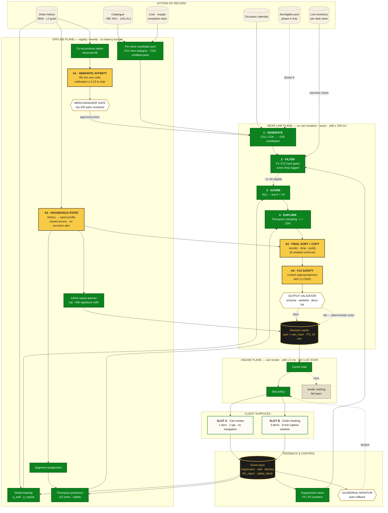

# The Cart Interrupt — MVP Specification

**Solution 2 of 3 · Blinkit Cross-Category Expansion**
**Owner:** TBD · **Status:** Draft for review · **Date:** 2 Aug 2026

---

## 0. TL;DR

74% of Blinkit checkouts complete in under 90 seconds through the reorder path. Any discovery surface that lives on the home feed is structurally unreachable for the target segment. **The Cart Interrupt puts a single, one-tap, new-category item on the two surfaces a habitual user cannot route around: the cart review screen and the 8-minute order-tracking screen.**

The critical framing: **this is not a new surface.** Blinkit already runs a recommendation rail on the cart page — it suggests butter when you buy bread. That rail is a complement/co-occurrence model, and complement models are precisely what locks the basket into grocery. The MVP is **a reserved slot with a different objective function on an existing surface.** That makes it a ranking-and-eligibility problem, not a design-and-build problem, and it is why this ships first.

**The AI layer does the work history-based models structurally cannot.** A co-occurrence recommender can only suggest what similar baskets already contain — its zero cells *are* the cross-category opportunity. An LLM carries world knowledge that fills those cells ("size-3 diapers + wipes → toddler in the house → rash cream, sipper cups, baby food"), infers household state from basket composition, performs the final sort, and writes the suggestion line. It runs under the same determinism gradient as ReviewLens: **the model proposes and explains; deterministic code disposes.** No LLM is ever in the cart-render path.

**Primary metric:** % of monthly active customers making a first purchase in a **new L1 category** within 30 days.
**Hard guardrail:** checkout conversion and cart→order time must not regress. If they do, the feature auto-disables.

---

## 1. Goal and Success Definition

| | |
|---|---|
| **North-star (program)** | ↑ % of MAC buying ≥1 new category/month |
| **Primary metric (this MVP)** | FPNC-30: % of exposed users making a first purchase in a new L1 category within 30 days of exposure |
| **Guardrail metrics** | Checkout CVR, cart→order median time, cart render p95 latency, order cancellation rate, support contact rate |
| **Counter-metric** | Category repeat rate at 60 days — a trial that never repeats is a discount, not a category unlock |
| **Explicit non-goal** | AOV. Adding a ₹99 BPC item at ~35% margin beats ₹99 of grocery at ~8%. Judge this on contribution margin per order, not AOV. |

### Why "new L1 category" and not "new SKU"

The goal metric is defined at **L1** in Blinkit's own taxonomy (see Appendix A). Not L0 — too coarse, "Beauty & Personal Care" would count a shampoo buyer as already-converted for skincare. Not L2 — too granular, "bought a different sunscreen" is not category expansion. L1 is the level at which the household actually adds a new job to Blinkit.

**Pin this definition before any code is written.** Every filter, every metric, and every experiment read depends on it.

---

## 2. Current State: Blinkit App UI/UX and Feature Inventory

> **Verification note.** Sections marked ✅ were verified directly against blinkit.com on 2 Aug 2026. Sections marked ⚠️ are reconstructed from public sources and secondary research — the web client gates cart and checkout behind a delivery-location selection, and the native app has surfaces the web client does not. **Anything marked ⚠️ must be checked against the internal app spec before build.** Do not treat this document as ground truth for those flows.

### 2.1 Surface map

```
Splash / Location gate
   │  "We need your location to show you curated assortment
   │   from your nearest store"  → store-level assortment binding
   ▼
┌─────────────────────────────────────────────────┐
│  HOME                                        ✅ │
│  ├─ Header: "Delivery in 8 minutes" + location  │
│  ├─ Search bar (rotating placeholder hints:     │
│  │   milk, bread, sugar, butter, paneer,        │
│  │   chocolate, curd, rice, egg, chips)         │
│  ├─ Cart pill: "N items · ₹X · View Cart"       │
│  ├─ L0 category groups → L1 tile grid           │
│  ├─ Promo / offer banners            ⚠️         │
│  ├─ "Buy Again" / reorder rail       ⚠️         │
│  └─ Occasion collections (Rakhi Gifts live)  ✅ │
└─────────────────────────────────────────────────┘
   │                    │                    │
   ▼                    ▼                    ▼
SEARCH ✅          PLP / CATEGORY ✅      REORDER ⚠️
   │               ├─ L2 subcategory       (order history,
   │               │   left rail            repeat basket,
   │               ├─ Product card grid     one-tap re-add)
   │               └─ SEO copy block
   │                    │
   └────────────────────┴──────────┐
                                   ▼
                        ┌──────────────────────┐
                        │  CART            ⚠️  │  ◀── INTERRUPT SLOT A
                        │  ├─ Line items       │
                        │  ├─ Existing rec rail│
                        │  │   (complement/    │
                        │  │    co-occurrence) │
                        │  ├─ Bill summary     │
                        │  ├─ Coupon entry     │
                        │  └─ Delivery slot    │
                        └──────────────────────┘
                                   ▼
                        ┌──────────────────────┐
                        │  CHECKOUT        ⚠️  │
                        │  ├─ Address          │
                        │  ├─ Payment (UPI,    │
                        │  │   card, COD,      │
                        │  │   wallet, netbank,│
                        │  │   BNPL, Sodexo,   │
                        │  │   Paytm Food)     │
                        │  └─ Place Order      │
                        └──────────────────────┘
                                   ▼
                        ┌──────────────────────┐
                        │  ORDER TRACKING  ⚠️  │  ◀── INTERRUPT SLOT B
                        │  ├─ Live rider map   │      (~8 min captive
                        │  ├─ Status timeline  │       attention window)
                        │  └─ Support entry    │
                        └──────────────────────┘
```

### 2.2 Verified taxonomy ✅

Four L0 groups exposed in primary navigation, resolving to 28 L1 categories. Full list in **Appendix A**.

**Finding worth escalating:** *Pet Care has no L1 entry point in the primary navigation captured on 2 Aug 2026* — despite being one of the five priority categories in the strategy deck and growing ~95% YoY online. Assortment is store-curated and the capture was made without a delivery location set, so **verify in-app in a live pet-stocked pincode before quoting this.** If it holds, it is the single most literal instance of the "buried category entry points" barrier in the research, and it is a one-line merchandising fix that should not wait for this MVP.

### 2.3 Product card anatomy ✅

Verified on the Sunscreen PLP:

| Element | Present | Notes |
|---|---|---|
| Delivery ETA badge | ✅ | "8 MINS" — reinforces the speed frame on every card |
| Discount badge | ✅ | "% OFF", top-left |
| Product image | ✅ | |
| Product name | ✅ | Includes spec in name (SPF, PA rating) |
| Pack size | ✅ | e.g. "50 g", "100 ml" |
| Selling price + MRP strikethrough | ✅ | |
| ADD button | ✅ | Single tap, no interstitial |
| Variant indicator | ✅ | "N options" |
| **Ratings / reviews** | ❌ | **Absent** |
| **Expiry / batch date** | ❌ | **Absent** |
| **Return / guarantee info** | ❌ | **Absent** |

The three absences are the machinery of the trust barrier (64% doubt freshness and returns on non-grocery). They are Solution 3's scope, not this MVP's — but they cap what the Cart Interrupt can achieve, and that ceiling should be stated when this experiment reads out.

### 2.4 Price-band reality check ✅ — this constrains the MVP

Live Sunscreen shelf, 30 SKUs observed: **₹179 – ₹1,260. Zero SKUs under ₹100.** Median around ₹380.

This is the single most important operational fact for the MVP:

> **The ₹49–₹99 trial packs from Solution 1 do not exist yet.** The Cart Interrupt MVP must run entirely on existing catalogue SKUs.

Consequences, all reflected in the filter design below:
- The price ceiling opens at **₹149**, not ₹99. Tighten to ₹99 once trial SKUs land.
- Candidate generation must prefer **the smallest available pack** in a category, not the best-selling one.
- Categories with no SKU under the ceiling are **structurally ineligible** in v1. Run the Appendix C audit before launch and expect to find that some priority categories cannot participate at all — that is itself a finding to hand to merchandising, and the strongest possible evidence for funding Solution 1.

### 2.5 Adjacent properties and features

| Feature | Status | Relevance |
|---|---|---|
| Existing cart recommendation rail | ⚠️ live | **The thing we are modifying.** Complement-based; reinforces grocery |
| Occasion collections (Rakhi Gifts) | ✅ live | Occasion is the strongest natural cross-category bridge in the research — reuse this inventory as a candidate source |
| E-Gift Cards, Print Store | ✅ live | Out of scope; exclude from candidates |
| Bistro (separate app) | ✅ live | Precedent for surface separation — and the reason we are *not* building a separate discovery tab |
| Blinkit Ambulance, District | ✅ live | Out of scope |
| Blinkit Prime / subscription | ⚠️ | May affect price sensitivity — carry as a ranker feature, not a filter |
| Live order tracking | ⚠️ | Hosts Slot B |
| 10-min returns (apparel/footwear only) | ⚠️ live | Solution 3's foundation; not available to BPC/Pet/Baby today |

---

## 3. Surface Selection

### 3.1 Chosen: two slots

**Slot A — Cart Review.** The last screen before payment. The user has committed to ordering but not yet to the total. One item, one tap.

**Slot B — Order Tracking.** ~8 minutes of captive attention, already open, zero checkout risk. This is the most underused inventory Blinkit owns. An add here creates a follow-on order rather than modifying the current one — lower conversion per impression, but **zero risk to the primary transaction**, which makes it the right place to be aggressive and to run exploration.

### 3.2 Rejected surfaces, with reasons

| Surface | Why rejected |
|---|---|
| **Home feed rebuild** | 74% of the target never meaningfully render it. Highest build cost, lowest reach. This is the deck's Intervention #2 and I would defer it. |
| **Search results injection** | Search is high-intent and keyword-driven; injecting off-query results degrades the core job and invites the "irrelevant results" complaint class. |
| **Separate discovery tab / app** | Moves the categories *further* from the 90-second session. Bistro worked because prepared food is a genuinely different job with different supply. This isn't. |
| **Post-payment interstitial (blocking)** | Blocks the confirmation the user is waiting for. Violates the speed promise psychologically even if it costs no time. |
| **Push notification** | Out-of-session, no cart context, already-saturated channel. |

---

## 4. MVP Scope

### In scope

- One reserved slot on the cart screen (Slot A), one module on the tracking screen (Slot B)
- Eligibility filter chain (§5.2) — the majority of the engineering value
- Rules-based ranker v0, then learned ranker v1 (§5.3)
- **AI layer A1–A4 (§5.6): semantic affinity graph, household-state inference, LLM final re-rank and suggestion copy, semantic safety gate**
- Category-level Thompson sampling for exploration (§5.4)
- Dismiss affordance with reason capture
- Full event instrumentation (§6)
- Experiment harness with auto-rollback guardrails (§7)

### Out of scope for MVP

- Trial-size SKU creation (Solution 1 — separate track, blocks the ₹99 ceiling)
- Returns/expiry badging (Solution 3 — separate track)
- **Any LLM call in the synchronous cart-render path** — architecturally forbidden, not deferred (§9)
- **Free-text LLM output rendered without validation** — every user-visible string passes the §5.6.5 validator or is replaced by a template
- Sponsored/paid slot monetization — **build the ranker so paid can be added later, but do not monetize in v1.** Introducing a bid term while measuring incrementality makes the readout uninterpretable.
- Home feed changes
- Multi-item bundles

---

## 5. Rankers and Filters

This is the core of the spec. The pipeline is: **candidate generation → hard filters → scoring → exploration → AI final sort → slot policy.** Filters are binary and auditable; scoring is continuous; exploration is stochastic; the AI layer is generative but bounded. Keeping these stages strictly separate is what makes the system debuggable when a bad recommendation ships.

### 5.0 The Discovery Engine — system map



**Legend** — same palette as the ReviewLens workflow diagram.

| | Class | Can it invent a fact? |
|---|---|---|
| 🟡 **Generative** | A1 · A2 · A3 · A4 | No — output bounded to closed enums, ID whitelists and a ≤40-char justification |
| 🟢 **Deterministic** | generation · filters · scoring · sampling · slot policy | No — pure code and arithmetic |
| ⬜ **Gate** | merchandiser review · output validator · guardrail monitor | No — these only ever subtract |
| ⬛ **Storage** | decision cache · event store | Immutable run log; cache is derived and flushable |

Solid edges are the happy path. **Dotted edges are fallbacks and conditionals** — and every one of them degrades the recommendation rather than the cart.

### 5.0.1 Three invariants the shape enforces

1. **The plane boundary is a latency contract.** Everything generative lives in the offline or near-line plane. The online plane does one cache read and renders, or renders nothing. There is no path by which a slow model produces a slow cart.
2. **The AI can only subtract from a pre-approved set.** F1–F12 run *before* A3 and cannot be re-opened by it; A4 and the validator only remove. The model reorders and justifies a list it did not choose the membership of.
3. **Every user-visible string crosses the validator.** No bypass, no debug exemption. If the whole AI layer is disabled, the engine still runs on deterministic sort and templated copy — degraded, not broken.

### 5.0.2 Component index

| Component | Does | Plane | Spec |
|---|---|---|---|
| CG1–CG6 | Assemble ~200 candidates | Near-line | §5.1 |
| F1–F12 | Binary eligibility gates, fail open | Near-line | §5.2 |
| F13 / A4 | Contextual safety, fails closed | Near-line | §5.2, §5.6.4 |
| S(c) | Score on add × margin × repeat | Near-line | §5.3 |
| Thompson sampling | 112 category arms, ε-allocation | Near-line | §5.4 |
| Slot policy | 1 item cart / 3 items tracking | Online | §5.5 |
| A1 Semantic Affinity | Fills co-occurrence zero cells | Offline | §5.6.1 |
| A2 Household State | Typed household profile | Offline | §5.6.2 |
| A3 Final sort + copy | **Ordering and suggestion line** | Near-line | §5.6.3 |
| Output validator | Schema, whitelist, deny-list | Near-line | §5.6.5 |
| Decision cache | Key: user × cart_hash | Near-line | §5.6.6, §9 |
| Suppression store | F5/F6 fatigue counters | Feedback | §5.2 |
| Guardrail monitor | Auto-rollback on breach | Feedback | §8.4 |

### 5.0.3 Request path in detail

The map above is the whole engine. This is the single-request slice through it, including the fallback branch:

```
                    ┌── A1 Semantic Affinity Graph (offline, LLM)
                    ├── A2 Household State Inference (offline, LLM)
                    │
Cart state ──▶ CG1..CG6 ──▶ ~200 candidates
                              │
                              ▼
                    F1..F12 hard filters      ◀── any single failure = drop
                              │                    (LLM cannot override)
                              ▼
                     ~5–40 eligible candidates
                              │
                              ▼
                    Score S(c)  (§5.3)  ──▶ top-K (K=10)
                              │
                              ▼
                Thompson sampling over category arms (§5.4)
                              │
                              ▼
        ┌─────────────────────────────────────────────┐
        │  A3  LLM FINAL SORT + SUGGESTION COPY       │  near-line, async
        │      in:  K candidate IDs + household state │  cached, never blocking
        │           + cart contents + occasion        │
        │      out: ordered IDs + reason_code + line  │
        └─────────────────────────────────────────────┘
                              │
                              ▼
                    A4 Semantic Safety Gate (F13)
                              │
                              ▼
                    §5.6.5 Output validator  ──▶ FAIL ──┐
                              │                          │
                              ▼                          ▼
                    Slot policy (§5.5)          deterministic order
                              │                  (LLM output discarded)
                              ▼
                    1 item (Slot A) / 3 items (Slot B)
                              │
                              ▼
                    Fail-open: empty result = render nothing
```

### 5.1 Candidate generation

Target: ~200 candidates, p99 ≤ 15ms, served from precomputed pools.

| ID | Source | Definition | Refresh |
|---|---|---|---|
| **CG1** | New-category inventory | All SKUs at the serving dark store in L1 categories the user has never purchased from | Daily (user history), real-time (inventory) |
| **CG2** | Cross-category affinity | L1 pairs where `lift(B\|A) = P(B in basket \| A in basket) / P(B) ≥ 1.2`, seeded by categories currently in cart. **Zero cells filled by A1 semantic priors (§5.6.1)** | Weekly batch |
| **CG3** | Occasion / calendar | SKUs in active occasion collections (festival, seasonal) — reuses the live Rakhi Gifts-style collection inventory | Merchandiser-managed |
| **CG4** | Segment affinity | Top new-category adoptions among the user's cohort (Household Manager lookalikes), collaborative-filtering derived | Weekly batch |
| **CG5** | Smallest-pack pool | Per L1 category, the N cheapest in-stock SKUs above the quality floor. **The workhorse until trial SKUs exist** | Daily |
| **CG6** | Sponsored pool | Ad-eligible SKUs. **Populated but not served in v1** — wired for phase 3 | Real-time |

**Weighting at generation:** CG1 ∪ CG5 form the base pool. CG2/CG3/CG4 act as *boost tags* carried into scoring rather than separate pools, so a candidate can be simultaneously affinity-linked and occasion-relevant.

### 5.2 Hard filters (eligibility gates)

Every filter is binary, independently loggable, and ordered cheapest-first for short-circuit evaluation. **Every drop must be logged with its filter ID** — the drop-reason histogram is the primary debugging tool for "why did nothing show."

| ID | Filter | Rule | Rationale |
|---|---|---|---|
| **F1** | `NEW_CATEGORY_GATE` | Zero purchases in candidate's **L1** category in trailing 365 days | Defines "new." Trailing 365d, not lifetime — a one-off purchase two years ago should not permanently disqualify a category |
| **F2** | `INVENTORY_GATE` | `available_qty ≥ 3` at serving dark store at request time | Promoting an OOS item breaks the 10-minute promise. Buffer of 3, not 1, to survive race conditions between render and checkout |
| **F3** | `PRICE_CEILING_GATE` | `price ≤ min(₹149, 0.15 × cart_subtotal)` | Relevance-to-cart-size. `cart_subtotal` is explicitly defined as **post-discount, pre-delivery-fee**. Upsell research: offers small relative to cart convert materially better. **Tighten to ₹99 when trial SKUs land** |
| **F4** | `BASKET_CONFLICT_GATE` | Not in cart; not a variant of a cart SKU; not same L2 as any cart item | Prevents "you added shampoo, here's shampoo" |
| **F5** | `RECENCY_SUPPRESSION_GATE` | Governed by the **Suppression Ladder** (3 sessions soft cooldown; 30d cooldown on 3 impressions with no add; 90d for price-band dismissal; 180d for category dismissal; **365d + A2 field zeroing** for Pet/Baby "not interested" dismissal) | Prevents banner blindness and nag fatigue. Respects explicit negative preference signals long-term |
| **F6** | `FATIGUE_GATE` | Max 1 Slot A impression per order; max 3 Slot A impressions per user per rolling 7 days | Protects the core experience. Aggressive by design in v1 — loosen only with evidence |
| **F7** | `COMPLIANCE_GATE` | Hard-exclude: Paan Corner (tobacco), Sexual Wellness, Health & Pharma, alcohol, E-Gift Cards, Print Store | **Non-negotiable.** These categories exist in the live taxonomy. Unsolicited surfacing is a regulatory and brand-safety incident, not a CTR trade-off. Requires a written sign-off from legal before launch |
| **F8** | `COLD_CART_GATE` | `cart_subtotal ≥ ₹149` AND `item_count ≥ 1` (`cart_subtotal` post-discount) | Do not interrupt a ₹40 single-item emergency order. Wrong moment, wrong user state |
| **F9** | `LOGISTICS_GATE` | Adding the item must not breach rider bag volume/weight limits or push the order into a different surcharge/slot tier | Never let a discovery nudge degrade the delivery promise or surprise the user with a fee change |
| **F10** | `MARGIN_GATE` | Contribution margin ≥ 15% | This program is justified on margin mix. A negative-margin recommendation defeats its own business case |
| **F11** | `QUALITY_GATE` | (≥ 20 units sold at store in trailing 30d, OR for dark stores <45 days old, inherit velocity from nearest same-tier store in city) AND complaint rate ≤ 2× category median | Prevents the slot becoming a dumping ground for dead stock — while allowing newly launched dark stores to participate without a 30-day cold-start lockout |
| **F12** | `LATENCY_GATE` | If ranker exceeds 40ms budget → return empty | **Fail open, never fail slow.** No recommendation is always better than a slower cart |
| **F13** | `SEMANTIC_SAFETY_GATE` | LLM-evaluated (cart × candidate) contextual appropriateness — see §5.6.4 | The only filter deterministic rules cannot express. F7 excludes categories *globally*; F13 catches context-dependent inappropriateness (a cart of pregnancy test + pain relief should not receive a celebratory or baby-category suggestion). Runs near-line, fails **closed** |
| **F14** | `TENURE_GATE` | `completed_orders ≥ 3` AND `tenure_days ≥ 14` | Brand-new users have no replenishment loop to interrupt. Suppresses zero-history accounts from being false-positive eligible across all categories |

**Filter design principle:** F7, F9, F10, F11 exist to prevent the slot from being captured by short-term optimization. Without them, the first quarter's pressure to show lift will fill this surface with clearance stock and high-bid items, and it will be dead within two quarters. Treat them as constitutional, not tunable.

**F13 is the one filter that fails closed.** Every other gate fails open (no recommendation). F13 failing open would mean shipping an unreviewed pairing; if the safety model is unavailable or its output fails validation, the candidate is dropped.

### 5.3 Scoring

**v0 — Rules baseline (Weeks 1–2, ships first).**

Deterministic priority ordering. The point is to prove the surface renders, converts at all, and does not hurt checkout — before any ML investment.

```
priority = (
    is_occasion_active(c),        # CG3 tag, descending
    affinity_lift(c),             # CG2 lift, descending
    segment_adoption_rate(c),     # CG4, descending
    -price(c)                     # cheapest first
)
```

**v1 — Learned ranker (Weeks 4–10).**

```
S(c) = p_add(c, u, ctx) × [ w₁·CM(c) + w₂·V_cat(c)·p_repeat(c) ] − λ·Risk(c)
```

| Term | Definition | Model |
|---|---|---|
| `p_add` | P(added to cart \| impression) | LightGBM, binary target, features in Appendix B |
| `CM(c)` | Contribution margin in ₹ | Deterministic from cost data |
| `p_repeat` | P(second purchase in same L1 within 60d \| first purchase) | LightGBM, trained on historical first-category-purchase cohorts |
| `V_cat` | Strategic value multiplier per L1 | **Config, not learned.** BPC / Pet / Baby weighted up per growth data. Reviewed quarterly by the PM, and the value is written down with a reason |
| `Risk(c)` | Estimated checkout-abandonment risk contribution | Estimated from the holdout arm; starts at 0 in v1 and is calibrated after the first read |
| `w₁, w₂, λ` | Weights | Start `w₁=1.0, w₂=3.0, λ=0` — deliberately over-weighting repeat over immediate margin |

**Why `p_repeat` carries 3× the weight of margin.** Optimizing `p_add × CM` alone produces a discount engine: it will learn to surface whatever is cheap and impulse-friendly, book a one-time add, and never unlock a category. `p_repeat` is the only term in the function that encodes the actual goal. If exactly one thing in this spec survives review, it should be this term.

### 5.4 Exploration

**Thompson sampling over category arms.**

- **Arm definition:** `(user_segment × L1_category)` — approximately 4 segments × 28 categories = 112 arms
- **Not SKU-level arms.** With 30,000+ SKUs, SKU-level exploration never converges, and the goal metric is category adoption, not SKU discovery
- **Posterior:** Beta(α, β) on add-rate per arm, updated nightly
- **Allocation:** ε = 20% of Slot A impressions and 40% of Slot B impressions in MVP; decay Slot A to 10% after 8 weeks
- **Cold start:** New arms initialize at Beta(1, 1) with a floor of 500 impressions before the posterior is trusted

**Diversity rule (applied post-sampling):** never show the same L1 category to the same user twice consecutively. Rotate across the top-3 eligible categories.

### 5.5 Slot policy

| | Slot A (Cart) | Slot B (Tracking) |
|---|---|---|
| Items shown | 1 | Up to 3 |
| Content type | SKU only | SKU or category tile |
| Exploration rate | 20% → 10% | 40% |
| Price ceiling | F3 applies | F3 relaxed to ₹299 (no live checkout risk) |
| Sponsored eligible | Phase 3 only | Phase 3 only |
| Dismiss affordance | Required | Required |
| Fail-open | Yes | Yes |

**Sponsored quality floor (for phase 3, written now so it isn't negotiated later):** a paid candidate may occupy Slot A only if it passes **every** organic gate F1–F13 **and** its `p_add` is within 80% of the top organic candidate's. Bid never substitutes for relevance in this slot.

---

### 5.6 The AI Layer

#### 5.6.0 Why an LLM belongs here at all

The strategy deck's root cause is that Blinkit's recommenders "over-index on past carts, trapping the user in an algorithmic replenishment loop." That is not a tuning failure — it is structural. **A collaborative-filtering or co-occurrence model can only propose what similar baskets already contain.** Its zero cells are, by definition, the categories nobody in the cohort has bought yet. Those zero cells are the entire cross-category opportunity. No amount of retraining on internal data can populate them.

An LLM's contribution is **world knowledge that the transaction log does not contain**: that size-3 diapers imply a toddler, that a cart of paneer, cream and cashews implies cooking for guests rather than a weekday meal, that a first-time dog-treat buyer will shortly need a chew toy and a lint roller. This is exactly the reasoning that turns a replenishment basket into a household model.

Four components, following the **ReviewLens determinism gradient** — generative → deterministic → templated, where the model's only free text is a justification, never a claim.

| | Component | Stage | Model | Can it invent a fact? |
|---|---|---|---|---|
| **A1** | Semantic Affinity Graph | Offline, weekly | `llama-3.3-70b` | No — output bounded to (L1, L1, score, enum reason) tuples, calibrated against observed lift |
| **A2** | Household State Inference | Offline, daily | `llama-3.3-70b` | No — closed enums only |
| **A3** | Final sort + suggestion copy | Near-line, async | `llama-3.1-8b-instant` | No — selects from supplied ID whitelist; copy passes validator |
| **A4** | Semantic safety gate (F13) | Near-line, async | `llama-3.3-70b` | No — returns `ALLOW`/`BLOCK` + enum reason |

Stack is Groq + Llama, matching the existing ReviewLens and Website pipelines (`Website/llm_engine.py`). Model IDs are config, not code — the interface contracts in Appendix D are what matter.

#### 5.6.1 A1 — Semantic Affinity Graph (offline, weekly)

**Job:** populate the zero cells of the co-occurrence matrix with reasoned priors.

**Input:** a basket signature (set of L1 categories + notable L2 markers, e.g. `{Baby Care: [diapers size 3, wipes], Dairy: [milk]}`).
**Output:** ranked L1 categories with a prior score ∈ [0,1] and a closed-enum reason (`LIFE_STAGE` · `COMPLEMENT` · `OCCASION` · `ROUTINE_ADJACENT` · `SEASONAL`).

**Calibration — the part that makes this trustworthy.** The LLM is run over *all* cells, including the ~30% where real co-occurrence data exists. Those cells are the validation set:

```
calibration_error = mean |llm_prior(A,B) − normalized_observed_lift(A,B)|   over populated cells
```

- If calibration error ≤ 0.15 → trust LLM priors in the zero cells, scaled by `(1 − calibration_error)`
- If 0.15 < error ≤ 0.30 → use LLM priors for candidate *generation* only, never for scoring weight
- If error > 0.30 → **A1 does not ship.** Fall back to co-occurrence-only CG2 and escalate

This is not optional rigour. Without it, A1 is an untested prior injected into a revenue-affecting ranker, and the first bad recommendation becomes unexplainable.

**Human gate:** the top 200 generated affinity pairs by score are merchandiser-reviewed before each weekly promotion. Rejections are retained with reasons and fed back as negative examples.

#### 5.6.2 A2 — Household State Inference (offline, daily)

**Job:** give the "Blocked Household Manager" a runtime representation. Today that segment exists only in a research deck; the ranker cannot address a segment it cannot compute.

**Input:** trailing 180-day purchase history, L2-level, no free text.
**Output:** a typed profile, closed enums only:

```json
{
  "household_size_band": "1|2|3-4|5+",
  "infant_present": true, "toddler_present": false,
  "pet": "none|dog|cat|other",
  "cooking_intensity": "low|medium|high",
  "hosting_frequency": "rare|occasional|frequent",
  "price_tier": "value|mid|premium",
  "segment": "household_manager|habitual_replenisher|deal_seeker|occasion_shopper",
  "confidence": 0.0-1.0
}
```

**Rules:**
- Any field with `confidence < 0.6` is emitted as `unknown` and treated as absent by the ranker. **The ranker must behave correctly on an all-`unknown` profile** — this is a required test case, not a fallback
- **Life-stage decay & dismissal rule:** Inferences carry a `last_corroborated_at`. Without corroboration in 60 days, confidence decays; at 90 days the field reverts to `unknown`. Explicit dismissal of Pet/Baby categories with "not interested" sets a **365-day suppression** on that L1 and immediately zeroes the corresponding A2 field.
- Inferences are **never surfaced to the user.** No copy may say "since you have a baby." Inference informs selection; it does not become a claim. Getting this wrong turns a helpful nudge into a privacy incident
- Sensitive inferences (pregnancy, health conditions, religion) are **not modelled at all** — excluded from the output schema by design, not filtered afterwards

#### 5.6.3 A3 — Final sort and suggestion copy (near-line, async)

**This is the "final sorting and suggestions" step.** It receives the top-K (K=10) survivors of filtering, scoring and Thompson sampling, and returns an ordering plus a one-line reason for each.

**Input contract:**
```json
{
  "cart": [{"l1": "Dairy, Bread & Eggs", "l2": "Milk"}, ...],
  "cart_subtotal": 480,
  "household_state": { ...A2 output... },
  "occasion_active": "rakhi" | null,
  "candidates": [
    {"id": "SKU_88213", "l1": "Baby Care", "l2": "Diaper Rash Cream",
     "name": "...", "pack": "50 g", "price": 129,
     "affinity_reason": "LIFE_STAGE", "is_exploration": false}
  ]
}
```

**Output contract:**
```json
{
  "ranked": [
    {"id": "SKU_88213", "rank": 1,
     "reason_code": "LIFE_STAGE",
     "reason_line": "Goes with the wipes you buy"}
  ]
}
```

**Hard constraints, enforced in code and not by prompt:**
1. Every returned `id` **must** exist in the input `candidates` array. Any unknown ID → **discard the entire response**, fall back to deterministic order, log `llm_reject{reason: unknown_id}`
2. The model may **reorder and drop**, never add
3. `reason_line` ≤ 40 characters, one clause, no urgency, no superlatives
4. Response must be valid JSON against the schema; one retry at half temperature, then fall back

**Why the small model here.** A3 runs on the request-adjacent path with a 300ms budget and the highest call volume. It is a constrained re-ranking task over ten pre-vetted options with a supplied reason taxonomy — not a reasoning task. The 70B model's job was already done offline in A1/A2. If A3's ordering does not beat the deterministic order in the arm-C experiment (§8.1), the correct response is to **delete A3**, keep A1/A2, and template the copy.

#### 5.6.4 A4 — Semantic safety gate (F13)

**Job:** catch inappropriate pairings that no deterministic rule can express.

F7 excludes sensitive categories globally. F13 handles the contextual case: the cart itself signals a situation in which an otherwise-fine suggestion becomes tone-deaf. Worked examples:

| Cart contains | Otherwise-eligible candidate | F13 |
|---|---|---|
| Pregnancy test, pain relief | Baby Care · celebratory items | **BLOCK** |
| Sanitary pads, painkillers | any promotional/festive tile | **BLOCK** |
| Infant formula, ORS at 2am | any non-essential | **BLOCK** |
| Milk, bread, eggs | Baby Care rash cream (infant_present) | ALLOW |

**Output:** `{"verdict": "ALLOW|BLOCK", "reason_code": <enum>}`. Nothing else.
**Fails closed.** Timeout, malformed output, or model unavailable → `BLOCK`.
**Cached** on `(cart_signature, candidate_l2)` — the space is small and the answers are stable, so steady-state call volume is low.

#### 5.6.5 Output validator (deterministic, always runs)

Every LLM output crosses this boundary before it can affect a user. No exceptions, no bypass flag.

| Check | Failure action |
|---|---|
| Valid JSON, matches schema | Retry once at temp 0, then fall back |
| All IDs ∈ input whitelist | **Discard whole response**, deterministic fallback |
| No IDs added | Discard |
| `reason_line` ≤ 40 chars | Truncate at word boundary, or template |
| `reason_line` passes deny-list: no price/discount claims, no returns or guarantee claims, no expiry claims, no urgency ("hurry", "last chance"), no health claims, no superlatives | Replace with templated line for `reason_code` |
| `reason_code` ∈ closed enum | Replace with `GENERIC` |
| F13 verdict = ALLOW | Drop candidate |

**The returns/expiry deny-list is load-bearing.** §6.3 establishes that Blinkit cannot honour a returns promise on BPC/Pet/Baby today. A model that helpfully writes "easy returns" would ship a promise the operation cannot keep and would damage Solution 3 before it launches. The deny-list is the enforcement mechanism for that decision.

**Every `reason_code` has a human-written fallback template.** If the entire AI layer is disabled, the surface still functions with templated copy — degraded, not broken.

#### 5.6.6 Cost and volume

The design keeps the LLM off the hot path and out of most requests:

| | Approach |
|---|---|
| **A1, A2** | Fully offline. A1 ≈ 28×28 category cells + basket signatures, weekly. A2 = daily incremental over active users only |
| **A3, A4** | Cached on `(household_state_id, cart_signature, candidate_set_hash)` where `cart_signature` = sorted L1 set + subtotal bucket — **not exact SKUs**. This collapses the key space by orders of magnitude |
| **Precompute** | The ~50k most frequent `(household_state × cart_signature)` cells are generated offline and warmed into cache. Live calls fire only on miss |
| **Online path** | **Zero LLM calls. Architecturally forbidden.** |

Expect ≥90% cache hit rate in steady state. **Validate this assumption in Phase 0** — cache hit rate is the variable that decides whether A3 is affordable at 3.7M orders/day, and it should be measured in shadow mode before A3 is built, not after.

**Budget guardrail:** if cost per 1,000 impressions exceeds the contribution margin of the incremental adds those impressions generate, A3 is switched off automatically. The AI layer must pay for itself at the unit level, and that check should be a monitored metric rather than a quarterly review.

---

## 6. UX Specification

### 6.1 Slot A — Cart Review

**Placement:** Below the line items, above the bill summary. **Visually distinct from the existing complement rail** — different container treatment, explicit label. If it reads as the same "butter with your bread" rail, it inherits that rail's banner blindness and the experiment reads flat for the wrong reason.

**Anatomy:**
```
┌──────────────────────────────────────────────┐
│  New for you · <L1 Category>            [×]  │
│  ┌────┐  <Product name>                      │
│  │img │  <Pack size>                         │
│  └────┘  ₹<price>  ₹<mrp>            [ ADD ] │
│  <reason_line — A3, validated §5.6.5>        │
│  <trust line — see 6.3>                      │
└──────────────────────────────────────────────┘
```

**Interaction rules:**
- ADD is a single tap; item is added inline. **No navigation away from cart.** Navigating away is the single most likely way to lose the order
- **Price & Inventory revalidation at ADD:** Stock and price are revalidated at the moment of the ADD tap (Invariant I2). If price has changed since prefetch, drop the suggestion silently rather than charging an unvalidated price.
- `[×]` dismisses for the session and writes a suppression record
- Long-press or a secondary tap on `[×]` offers reasons: *Not interested in this category · Too expensive · Already buy this elsewhere · Not now*
- **Accessibility & Font Scaling:** Under Dynamic Type / large accessibility fonts, the reason line truncates with an ellipsis at 2 lines max or is hidden entirely if font scale exceeds threshold, preserving fixed card container height.
- No animation, no auto-expand, no timer. The user is mid-transaction

**Copy principles & Locale Strategy:** State the category, not a sales pitch. "New for you · Pet Care" outperforms "You'll love this!" for a time-poor, value-conscious segment. For non-English app locales, copy banks are generated per supported language (e.g. Hindi) with human review; in unsupported locales, the reason line is suppressed and falls back to category label. Avoid urgency language entirely — it collides with the speed frame and reads as pressure. These principles are encoded in the §5.6.5 deny-list, so they hold whether the line is model-written or templated.

**The reason line must never expose an inference.** A3 may write "Goes with the wipes you buy" — grounded in an observable purchase. It may not write "For your baby" — that surfaces an A2 inference as a claim about the user's life. Enforced by the validator, and worth a specific review pass on generated copy samples before launch.

### 6.2 Slot B — Order Tracking

**Placement:** Below the live tracking map and status timeline. Never above — the user opened this screen for the ETA.

```
Arriving in 8 minutes
─────────────────────────────
While you wait
┌────────┐ ┌────────┐ ┌────────┐
│  SKU   │ │  SKU   │ │ Cat    │
│  ₹XX   │ │  ₹XX   │ │ tile   │
└────────┘ └────────┘ └────────┘
```

Adds here create a **new** order (or append to the current one if the store has not yet dispatched — check operational feasibility with fulfilment before committing to append semantics; the append case is materially better UX but may not be supportable).

### 6.3 The trust line

One line under the price, category-dependent. In MVP, honesty constrains what we can say — the returns and expiry infrastructure does not exist for these categories yet:

| Available today | Text |
|---|---|
| ✅ | "Delivered in 8 minutes" |
| ✅ | "Smallest pack available" |
| ✅ | "<N> bought near you this week" (only if N ≥ 50, else omit) |
| ❌ Blocked on Solution 3 | "Easy returns" / "Expiry: <date>" |

**Do not ship a returns claim the operation cannot honour.** The trust barrier is 64% of the research; a broken promise here is worse than silence and would poison Solution 3 before it launches.

---

## 7. Events and Instrumentation

Every event carries: `user_id`, `session_id`, `cart_id`, `store_id`, `experiment_arm`, `ranker_version`, `timestamp`.

| Event | Payload | Purpose |
|---|---|---|
| `interrupt_eligible` | `candidate_count`, `drop_reasons[{filter_id, count}]` | **Fires even when nothing renders.** The drop-reason histogram is the primary debugging surface |
| `interrupt_impression` | `slot`, `sku_id`, `l1_category`, `score`, `is_exploration`, `arm_id`, `price`, `cart_subtotal`, `reason_code`, `copy_source: llm\|template`, `llm_rank`, `deterministic_rank` | Denominator for everything. `llm_rank` vs `deterministic_rank` is what proves A3 earns its place |
| `llm_rerank` | `model_id`, `cache_hit`, `latency_ms`, `input_tokens`, `output_tokens`, `reorder_distance` | A3 cost, latency and behaviour. `reorder_distance` = Kendall tau vs deterministic order; if it trends to 0, A3 is doing nothing |
| `llm_reject` | `stage: A1\|A2\|A3\|A4`, `reason: unknown_id\|schema\|denylist\|timeout\|added_id`, `fell_back_to` | **Validator rejections. A rising rate is the earliest signal of model or prompt drift** |
| `safety_block` | `cart_signature`, `candidate_l2`, `reason_code` | F13 blocks. Reviewed weekly — both for misses and for over-blocking |
| `interrupt_add` | `sku_id`, `l1_category`, `price`, `time_to_add_ms` | Primary conversion |
| `interrupt_dismiss` | `sku_id`, `reason_code` | Negative signal for the ranker |
| `interrupt_ignored` | implicit at checkout | Derived, not emitted |
| `cart_render_latency` | `ranker_ms`, `total_ms`, `cache_hit` | Latency guardrail |
| `first_purchase_new_category` | `l1_category`, `attributed_slot`, `days_since_impression` | **The goal metric.** Fires regardless of whether the interrupt caused it — attribution happens in analysis |

**Attribution rule:** `first_purchase_new_category` within 30 days of an impression **in the same L1 category** is attributed to the interrupt. All other new-category purchases are unattributed but still counted in the arm-level rate. The experiment is read on **arm-level rates with holdout comparison**, never on click-attributed conversions — click attribution will overstate this feature's effect substantially, and the difference is exactly what the holdout exists to measure.

---

## 8. Experiment Design

### 8.1 Structure

| | |
|---|---|
| **Randomization unit** | User (not session) — fatigue caps and 30/60-day repeat measurement are per-user |
| **Unauthenticated / Guest sessions** | **Excluded entirely** — guest sessions receive no slot, no hashing assignment, and are excluded from experiment analysis |
| **Prefetch timeout filtering** | Users experiencing prefetch timeouts (>300 ms) emit `prefetch_timeout` and are excluded from experiment comparison across all arms to avoid device/network bias |
| **Arms** | **A** Control (existing cart rail unchanged) · **B** Interrupt slot, deterministic sort + templated copy · **C** Interrupt slot, AI final sort + AI copy (A3/A4 live) |
| **Split** | 34/33/33 within the exposed population |
| **Long-run holdout** | Additional 5% never-treated, maintained 90 days, for decay and cannibalization measurement |
| **Duration** | Minimum 3 weeks |
| **Geography** | 2 cities, ~2% of users initially |

### 8.2 Why deliberately under-scale

At Blinkit's volume this experiment is wildly over-powered. Detecting a +1.5pp lift on an assumed 8% FPNC-30 baseline at 80% power needs roughly **5,700 users per arm** — reachable in hours.

Sample size is therefore not the binding constraint. **Blast radius and novelty are.** So:
- Start at ~2% of users in 2 cities. There is no statistical reason to go wider and a strong operational reason not to
- Run ≥3 weeks regardless of significance — a novel UI element inflates engagement in week 1 and the effect commonly decays by week 3. **Reading this at day 4 will produce a wrong and expensive decision**
- Avoid festival windows for the baseline read, or stratify explicitly — occasion periods distort cross-category behaviour by the very mechanism this feature exploits

**Arm B exists to keep the AI honest.** Comparing C against A only proves "the surface works." Comparing **C against B** isolates the AI layer's contribution — and it is entirely possible that a reserved slot with a sensible deterministic sort captures most of the value. If C does not beat B, A3 is deleted and the copy is templated. A1 and A2 are evaluated separately, since they feed candidate generation in both B and C and would survive that outcome.

### 8.3 Decision criteria

**Ship if:** FPNC-30 lift ≥ +1.0pp absolute, statistically significant at 95%, **and** all guardrails hold, **and** 60-day category repeat rate among converts ≥ 25%.

**Keep the AI final-sort layer (A3/A4) if:** arm C beats arm B on FPNC-30 by ≥ +0.4pp at 95% significance, **and** A3's cost per incremental add is below its contribution margin (§5.6.6), **and** `llm_reject` rate < 2%. Otherwise ship arm B and retain only A1/A2.

**The repeat condition is not optional.** Lift on FPNC with weak repeat means a discount engine was built, not a discovery engine — and it will not survive contact with the P&L.

**Iterate if:** FPNC lift positive but < 1.0pp, or repeat rate 15–25%.
**Kill if:** any guardrail breached at significance, or FPNC lift ≤ 0 after 3 weeks with healthy impression volume.

### 8.4 Auto-rollback triggers

Continuously evaluated; any breach disables the slot without human intervention.

| Trigger | Threshold | Action |
|---|---|---|
| Checkout CVR | −0.3% relative | Full rollback |
| Cart→order median time | +5 s | Full rollback |
| Cart render p95 latency | +80 ms | Disable slot, keep experiment |
| Order cancellation rate | +0.5% absolute | Full rollback |
| Support contact rate on affected orders | +10% relative | Full rollback |
| Return/complaint rate on interrupt-sourced SKUs | > 2× baseline | Pause that L1 category only |
| `llm_reject` rate | > 5% of A3 calls | Disable A3, serve deterministic sort + templated copy |
| A3 p99 latency | > 500 ms | Disable A3, keep slot live |
| A3 cost per 1k impressions | > incremental CM per 1k impressions | Disable A3 |
| F13 block rate | > 15% or < 0.1% | Alert — over-blocking or silently broken |

---

## 9. Architecture and Latency Budget

**Non-negotiable: the cart must not get slower.** The 10-minute promise is the product; a feature that taxes it fails regardless of its lift.

```
OFFLINE (daily/weekly)          NEAR-LINE (on cart mutation)     ONLINE (cart render)
──────────────────────          ────────────────────────────     ────────────────────
user × L1 purchase       ──┐
  history (365d)           │
co-occurrence matrix       │    async job:                  ──▶  read cache
  + A1 semantic priors 🤖  ├──▶  CG1..CG6 → F1..F12 →             key: (user, cart_hash)
A2 household states     🤖 │     score → top-K=10 →               p99 ≤ 5 ms
segment assignment         │     A3 LLM sort 🤖 (cached) →        MISS → render nothing
per-store candidate pool   │     A4 F13 safety 🤖 (cached) →      NO LLM. EVER.
A3/A4 cache warming     🤖 ┘     validator → cache
                                 p99 ≤ 300 ms · TTL 15 min
```
🤖 = LLM stage. Note that all of them sit left of the online boundary.

| Stage | Budget |
|---|---|
| Cache read (online path) | p99 ≤ 5 ms |
| Full ranker incl. A3/A4 (near-line, async) | p99 ≤ 300 ms |
| A3 LLM call, cache miss | p99 ≤ 500 ms → else disabled |
| Synchronous fallback ranker | p99 ≤ 40 ms, hard-capped by F12 |
| Added cart render time | **p95 ≤ 0 ms** (cache read overlaps existing calls) |

**The online/near-line boundary is the single most important line in this architecture.** An LLM call in cart render would add 200–500ms to the most latency-sensitive screen in a product whose entire promise is speed. The async design means a slow or failed model degrades the *recommendation* — never the cart. Any future proposal to "just call the model inline for freshness" should be refused on this basis.

**Cache miss policy: render nothing.** No blocking call, no spinner, no placeholder. A missing recommendation is invisible; a slow cart is not.

**Inventory freshness caveat:** F2 runs against cached inventory in the near-line path. Re-validate at ADD time and fail gracefully ("just went out of stock") rather than accepting the order and failing at fulfilment.

---

## 10. Rollout Plan

| Phase | Weeks | Scope | Gate to proceed |
|---|---|---|---|
| **0 · Instrument** | 1–2 | Events, drop-reason logging, filter chain, **no UI**. Shadow-run A1 calibration and measure A3 cache-hit rate | Drop-reason histogram sane; ≥60% of carts have ≥1 eligible candidate; **A1 calibration error ≤ 0.15** |
| **1 · Rules v0 (arm B)** | 3–5 | Slot A, deterministic sort, templated copy, 2 cities, 2% | Guardrails hold; add-rate ≥ 3% |
| **2 · AI layer (arm C)** | 5–8 | A2 household states, A3 sort + copy, A4/F13, validator | Arm C > arm B by ≥ +0.4pp; `llm_reject` < 2% |
| **3 · Slot B** | 7–9 | Tracking-screen module | Guardrails hold |
| **4 · Learned ranker** | 9–13 | `p_add` + `p_repeat` models, Thompson sampling | FPNC-30 lift ≥ +1.0pp |
| **5 · Scale** | 14–17 | 25% → 100%, all cities | Repeat rate ≥ 25% at 60 days |
| **6 · Monetize** | 18+ | Sponsored pool with quality floor | Only after clean organic incrementality read |

**Arm B ships before arm C deliberately.** Building the AI layer first would make it impossible to tell whether lift came from the slot or the intelligence — and the slot alone may be most of it. Phase 1 establishes the baseline the AI has to beat.

**A1 calibration is a Phase 0 gate, not a Phase 2 activity.** It requires no UI and no user exposure — only the existing co-occurrence data. If the model cannot reproduce known affinities, that is worth discovering in week 1 for the cost of a batch job.

**Phase 0 has no UI on purpose.** Running the filter chain in shadow mode for two weeks answers "is there anything eligible to show?" before a single pixel is designed. If eligible-candidate coverage comes back at 20% — entirely plausible given the price-band finding in §2.4 — the correct response is to escalate Solution 1 and delay this build, not to loosen F3 until something qualifies.

---

## 11. Risks

| Risk | Severity | Mitigation |
|---|---|---|
| **No eligible candidates** — price ceiling excludes most of catalogue (§2.4) | **High** | Phase 0 shadow run quantifies it before build. If coverage < 40%, this becomes evidence to fund Solution 1 first |
| Checkout conversion regression | High | Auto-rollback at −0.3%; Slot B carries zero checkout risk |
| Trust barrier caps conversion | Medium | Expected. Read this experiment as a *floor* on the mechanism's value, and re-run after Solution 3 ships |
| Banner blindness within 6 weeks | Medium | F5/F6 fatigue caps; exploration keeps content fresh; monitor week-over-week add-rate decay |
| Slot captured by clearance stock | Medium | F10 margin floor, F11 quality floor, no monetization in v1 |
| Compliance incident (F7 leak) | **Severe** | Hard-coded exclusion list, unit-tested, legal sign-off pre-launch, alert on any impression in an excluded L1 |
| Novelty effect misread as success | Medium | 3-week minimum; 90-day holdout |
| Cannibalizes existing complement rail | Medium | Long-run holdout measures net basket effect, not just slot-level adds |
| **LLM hallucinates a SKU that doesn't exist / isn't in stock** | **High** | ID whitelist enforced in code (§5.6.5). Unknown ID → whole response discarded. The model physically cannot introduce an item; it can only reorder a pre-filtered list |
| **A1 semantic priors are confidently wrong** | High | Calibration against observed lift is a Phase 0 ship gate. Merchandiser review of top 200 pairs weekly |
| **A2 inference surfaces as a claim** ("For your baby") | **High — privacy** | Sensitive attributes excluded from the schema entirely; validator deny-list; copy review pass pre-launch; inferences never rendered |
| **Model or prompt drift degrades quality silently** | Medium | `llm_reject` rate and `reorder_distance` monitored with alerts; model ID pinned in config, never floating |
| **A3 cost scales past its own value** | Medium | Cache-hit rate validated in Phase 0; automatic shutoff when cost/1k impressions exceeds incremental CM |
| **AI layer becomes unfalsifiable** ("it must be helping") | Medium | Arm B vs arm C is the entire answer. If C doesn't beat B, A3 is deleted |
| **F13 over-blocks and starves the slot** | Low | Block-rate alert at >15%; weekly review of blocked pairs |

---

## 12. Open Questions

Blocking:
1. **Baseline FPNC-30.** Not public; needed to size the experiment and set the ship bar. *Owner: analytics.*
2. **Does the existing cart rail have a reserved slot mechanism**, or does this require new rendering infrastructure? Determines whether Phase 1 is 2 weeks or 6. *Owner: eng.*
3. **F7 exclusion list sign-off.** *Owner: legal.*

Non-blocking but decision-shaping:
4. Eligible-candidate coverage under F1–F13 (answered by Phase 0)
5. Cross-category affinity matrix — does it exist internally, or must it be built? Determines how much of the matrix A1 has to fill and how large the calibration set is
6. Can Slot B append to an undispatched order, or must it create a new one?
7. **Pet Care navigation entry point** (§2.2) — verify in-app; may be a same-week merchandising fix independent of this MVP
8. Is inference-based personalization (A2) covered by the current privacy policy and consent language? *Owner: legal + privacy.* Blocking for A2, not for the rest of the MVP
9. Does Blinkit have an existing internal LLM gateway with logging and rate limiting, or does this pipeline stand up its own Groq integration as ReviewLens did?

---

## Appendix A — Verified L1 Taxonomy

Captured from blinkit.com primary navigation, 2 Aug 2026.

| L0 | L1 categories |
|---|---|
| **Grocery & Kitchen** | Vegetables & Fruits · Atta, Rice & Dal · Oil, Ghee & Masala · Dairy, Bread & Eggs · Bakery & Biscuits · Dry Fruits & Cereals · Chicken, Meat & Fish · Kitchenware & Appliances |
| **Snacks & Drinks** | Chips & Namkeen · Sweets & Chocolates · Drinks & Juices · Tea, Coffee & Milk Drinks · Instant Food · Sauces & Spreads · ~~Paan Corner~~ · Ice Creams & More |
| **Beauty & Personal Care** | Bath & Body · Hair · Skin & Face · Beauty & Cosmetics · Feminine Hygiene · Baby Care · ~~Health & Pharma~~ · ~~Sexual Wellness~~ |
| **Household Essentials** | Home & Lifestyle · Cleaners & Repellents · Electronics · Stationery & Games |
| **Other surfaces** | ~~Print Store~~ · ~~E-Gift Cards~~ · Rakhi Gifts (seasonal collection) |

~~Strikethrough~~ = excluded by `F7 COMPLIANCE_GATE`.
**Pet Care absent from captured navigation — see §2.2.**

## Appendix B — Ranker Feature Set (v1)

**User:** tenure, orders/month, distinct L1 categories purchased (365d), avg basket value, price-tier index, segment, Prime status, dismiss history, session count 30d
**Cart:** subtotal, item count, distinct L1 count, has-fresh-items, has-impulse-items, time-of-day, day-of-week, session duration to cart
**Candidate:** price, price ÷ cart_subtotal, L1, L2, pack size, discount %, store velocity 30d, margin %, days since listed, brand tier
**Interaction:** affinity lift (cart L1 × candidate L1), segment adoption rate, prior impressions of this L1, occasion-active flag
**Context:** store ID, city tier, current ETA, weather flag, festival-window flag

## Appendix C — Pre-Launch Audit (run in Phase 0)

For each of the 28 L1 categories, per store:

1. Count SKUs passing F3 at ₹149 → **category eligibility**
2. Count SKUs additionally passing F10 and F11 → **usable candidate depth**
3. Flag categories with usable depth < 3 → **structurally excluded in v1**
4. Compute: % of carts with ≥1 eligible candidate → **the coverage number that gates the whole build**

Expected output: a one-page table that either green-lights Phase 1 or redirects the roadmap to Solution 1. **Either result is a good outcome for two weeks of work.**

## Appendix D — LLM Interface Contracts

Model IDs live in config. Contracts do not change with the model.

| | A1 Affinity | A2 Household | A3 Sort + Copy | A4 Safety |
|---|---|---|---|---|
| Stage | Offline weekly | Offline daily | Near-line async | Near-line async |
| Model | `llama-3.3-70b` | `llama-3.3-70b` | `llama-3.1-8b-instant` | `llama-3.3-70b` |
| Temperature | 0.3 | 0.0 | 0.2 | 0.0 |
| Max output tokens | 1024 | 256 | 512 | 32 |
| Response format | JSON schema | JSON schema | JSON schema | JSON schema |
| Retry policy | 2× backoff | 2× backoff | 1× at temp 0 | 1×, then BLOCK |
| Cache key | `(basket_signature)` | `(user_id, history_hash)` | `(household_state_id, cart_signature, candidate_set_hash)` | `(cart_signature, candidate_l2)` |
| Fail mode | Skip cell, log | Emit `unknown` | Deterministic order | **BLOCK** |
| Free text permitted | reason enum only | none | `reason_line` ≤ 40 chars | none |

### Invariants (from the ReviewLens determinism gradient)

1. **No LLM output reaches a user without crossing the §5.6.5 validator.** No bypass flag, no debug exemption.
2. **No LLM stage can override a deterministic filter.** F1–F12 run before A3 and cannot be re-opened by it. A4 can only subtract.
3. **The LLM selects, orders and justifies. It never asserts.** Free text is limited to a grounded reason line; prices, availability, returns, expiry and delivery times are rendered from system data only.
4. **Every stage has a working fallback**, and the fallback path is exercised in CI. The surface must degrade to templated copy without a deploy.
5. **Runs are logged immutably** — input hash, model ID, output, validator verdict — so any user-visible recommendation can be reconstructed and explained after the fact.

### Prompt contract — A3 (illustrative)

```
SYSTEM
You re-rank pre-approved product suggestions for a grocery delivery cart.

Rules:
- Return ONLY ids present in the input candidates array. Never invent an id.
- You may reorder and drop. You may not add.
- reason_line: max 40 chars, one clause, states an observable link to the
  cart or purchase history.
- Never mention price, discounts, returns, guarantees, expiry, or delivery time.
- Never reference inferred personal attributes (pregnancy, health, family
  composition, religion). Reference only what is in the cart.
- No urgency, no superlatives, no exclamation marks.
- Output valid JSON matching the schema. No prose.

USER
{ cart, cart_subtotal, household_state, occasion_active, candidates }
```

The negative constraints are duplicated in the validator on purpose. **Prompts express intent; code enforces it.** Anything that would be a real incident if it slipped through is checked twice.

---

## Sources

Verified directly: [blinkit.com](https://blinkit.com) home, category navigation, and Sunscreen PLP (2 Aug 2026).

Research inputs: [Blinkit Q1 FY27 results](https://www.storyboard18.com/brand-marketing/blinkit-q1-fy27-revenue-jumps-552-percent-ebitda-positive-ws-l-105157.htm) · [Eternal Q1 FY27 — Business Standard](https://www.business-standard.com/companies/quarterly-results/eternal-q1-fy27-profit-rises-fourfold-to-rs-92-crore-on-blinkit-growth-126072201321_1.html) · [Post-purchase upsell benchmarks](https://www.loopwork.co/blog/shopify-post-purchase-upsell-boost-aov) · [Confirmation-page take rates](https://www.digitalapplied.com/blog/post-purchase-upsell-thank-you-page-2026-ecommerce-playbook) · [Instacart sales-lift methodology](https://www.instacart.com/company/instacart-ads/introducing-new-sales-lift-metrics) · [Blinkit cart recommendation behaviour](https://medium.com/design-bootcamp/how-smart-design-makes-you-buy-faster-lessons-from-blinkit-zepto-rapido-minimalist-d7b9439da2bd) · [Blinkit reorder flow analysis](https://medium.com/uxm-community/revamping-the-blinkits-reorder-flow-experience-with-an-aim-to-increase-repeat-purchase-rate-and-da88512fb380) · [Blinkit app feature set](https://apps.apple.com/in/app/blinkit-grocery-in-10-minutes/id960335206) · [Q-commerce BPC growth — Redseer](https://redseer.com/digests/quick-commerce-and-bpc-strategy-in-india/)
